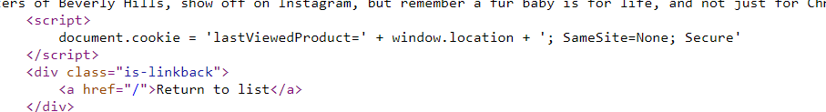
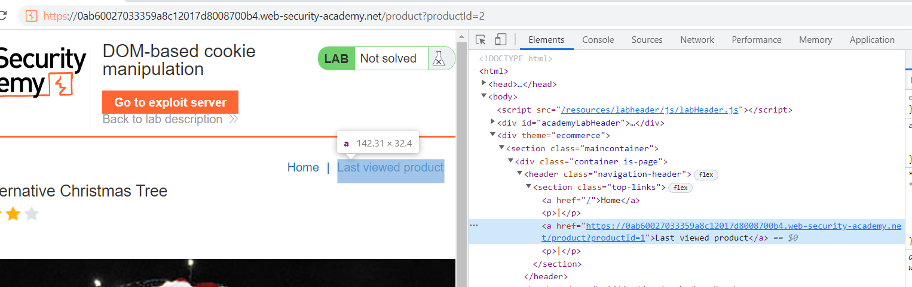
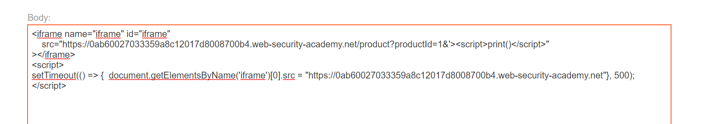

## DOM-based cookie manipulation

1. Nhận thấy khi vào trang product có đoạn js set cookie `lastViewedProduct` có giá trị bằng url hiện tại.



2. Khi vào trang product id = 2 thấy hiện lên thẻ a với href về trang product trước đấy. Tức là giá trị của thẻ a được fetch từ giá trị của cookie `lastViewedProduct`.



3. Nhận thấy url không bị escape, craft url để gọi đến print() ```https://0ab60027033359a8c12017d8008700b4.web-security-academy.net/product?productId=1&c=c%27%3Cscript%3Eprint()%3C/script%3E``` 

-> lúc này cookie `lastViewedProduct` sẽ có giá trị là url chứa mã khai thác trên. Tức là giờ khi click vào thẻ a sẽ dẫn ta đến trang đã dính lỗi 

4. Craft trang exploit. Sử dụng iframe để đến url chứa payload để thẻ a được gán cho url dính lỗi rồi quay lại trang home để chuyển cho victim 

