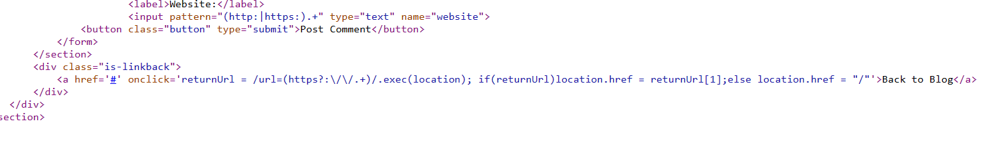

## DOM-based open redirection

1. Trong source của lab có đoạn xử lý redirect bắt được bằng sự kiện onclick.



2. Đoạn mã check xem đoạn regex `/url=(https?:\/\/.+)/` có trong chuỗi url hay không. Nếu có thì redirect đến url đó. 

3. Thêm param url vào sau url hiện tại 
- Payload: ```https://0a54001b03fab35ec1c60963003a00a8.web-security-academy.net/post?postId=3&url=https://google.com``` 

-> Nhận thấy trang redirect ta đến trang google.com

4. Craft payload thành ```https://0a54001b03fab35ec1c60963003a00a8.web-security-academy.net/post?postId=3&url=https://exploit-0a04000903b3b3fdc11f0845012a004f.exploit-server.net/```

