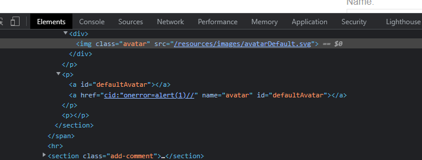

## Exploiting DOM clobbering to enable XSS (REFER)

1. Trong hàm `loadComment()` có đoạn code 


2. Lab cho sử dụng các thẻ html nhất định được filter bằng `DOMPurify` object. Dùng DOM clobbering để khai thác đoạn code trên.

- Payload:
```
<a id=defaultAvatar></a>
<a id=defaultAvatar name=avatar href="cid:&quot;onerror=alert(1)//"></a>
```

3. Khi dùng protocol `cid`, dấu `"` không bị urlencode và DOMPurity không phát hiện mã XSS 


4. Với payload trên, do 2 thẻ có cùng id nên chúng được gộp vào 1 DOM collection. Từ đó với `name=avatar` thuộc tính avatar trong sẽ bị ghi đè bởi giá trị của href. Do đó,  biến defaultAvatar được gán thuộc tính bị ghi đè {avatar: 'cid:"onerror=alert(1)//'}.



5. Sau đó nhập một comment bất kỳ để gán src thành giá trị của avatar. Để img kích hoạt xss

