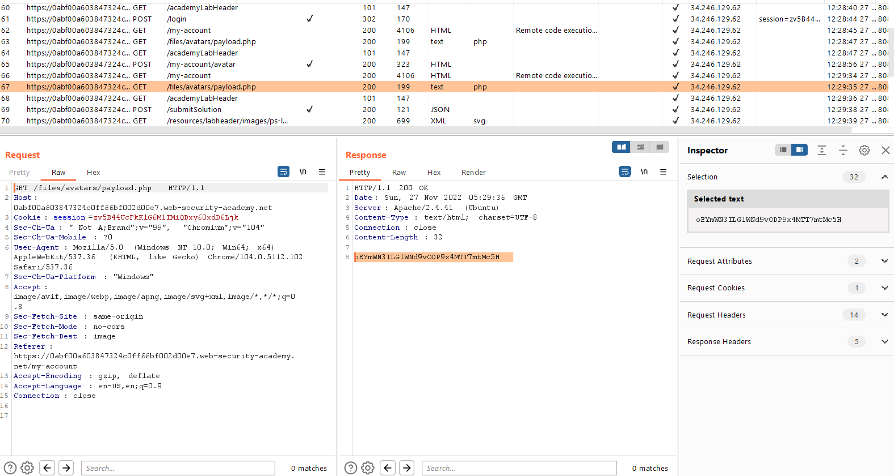

## Remote code execution via web shell upload

1. Theo yêu cầu của lab, ô input upload avatar có chứa lỗ hổng upload. Nó không thực hiện bất kỳ validate file upload nào. Gửi file ``payload.php`` có nội dung:
- ```<?php echo file_get_contents('/home/carlos/secret'); ?>```

2. Sau khi nhận thông báo upload file thành công, trong HTTP history nhận thấy có 1 request với url ``/files/avatars/payload.php`` có response trả về có chứa secrect output của carlos.

