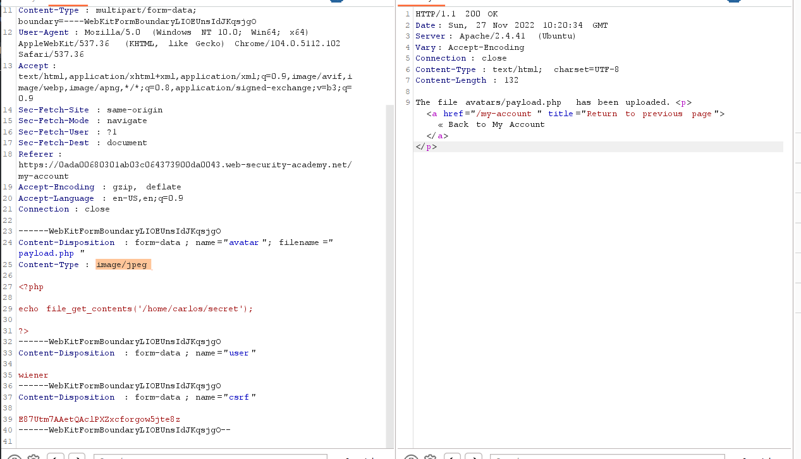

## Web shell upload via Content-Type restriction bypass

1. Theo yêu cầu của lab, ô input upload avatar có chứa lỗ hổng upload. Gửi thử file ``payload.php`` có nội dung:
- ```<?php echo file_get_contents('/home/carlos/secret'); ?>```

2. Nhận được thông báo lỗi với nội dung chỉ file png, jpg được chấp nhận. Gửi thử một file jpg lên, response trả về thực thi thành công. Trong request ở ``Content-Type`` header có nội dung là: ``image/png``.

3. Cho request upload file ``payload.php`` vào Burp Repeater sửa ``Content-Type`` thành ``image/png`` 



-> Nhận được thông báo upload thành công file ``payload.php``

4. Trong HTTP history nhận thấy có request ``files/avatars/payload.php`` có response chứa secret output. 