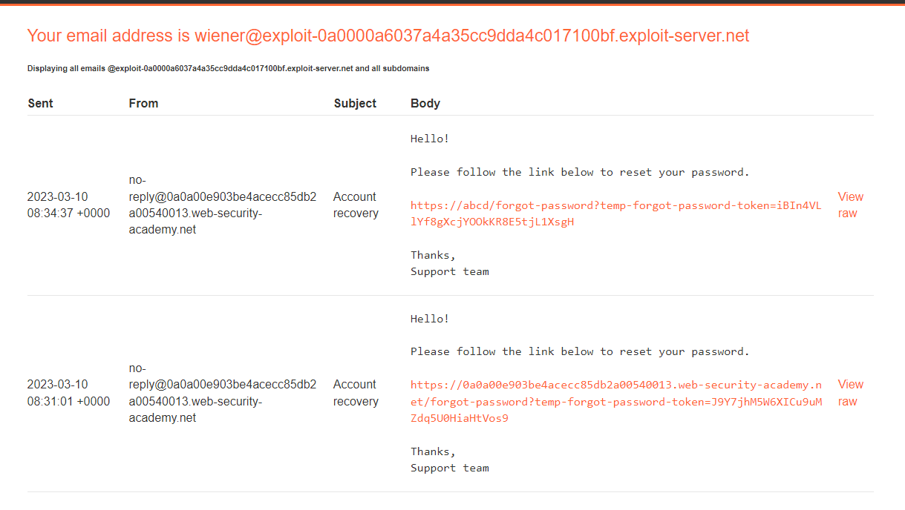
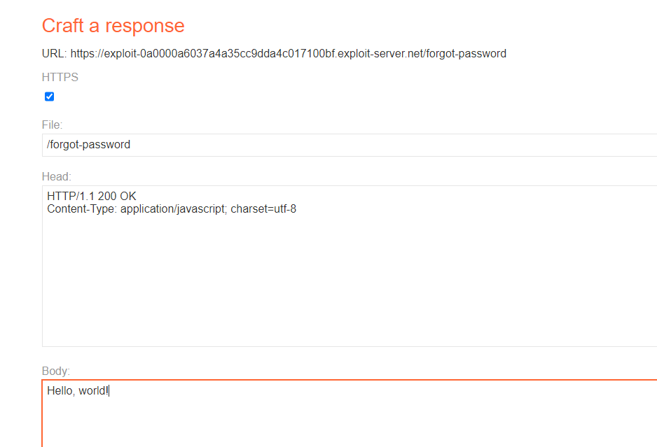
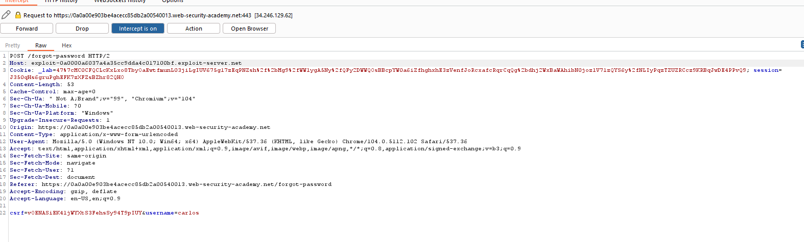
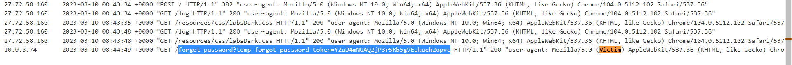

## Basic password reset poisoning

1. Thử tính năng quên mật khẩu cho tài khoản wiener. Link đổi mật khẩu trong email có dạng `https://0a0a00e903be4acecc85db2a00540013.web-security-academy.net/forgot-password?temp-forgot-password-token=J9Y7jhM5W6XICu9uMZdq5U0HiaHtVos9`

2. Thử lại nhưng lần này dùng một giá trị bất kỳ cho header `Host` nhận thấy url để change password thay đổi theo.

3. Được biết user `carlos` sẽ click vào mọi đường link trong email dó đó ta sẽ tiến hành craft trang exploit server để bắt được log khi `carlos` click vào đường link đổi mật khẩu.

4. Gửi POST request forgot password với giá trị host trỏ tới trang exploit server và `username=carlos`

5. Mở access log nhận thấy có một request được gửi từ phía victim chứa forgot password token

6. Đổi pass rồi login
