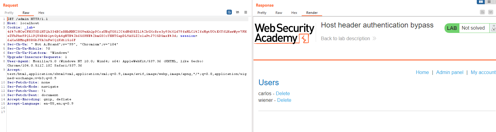
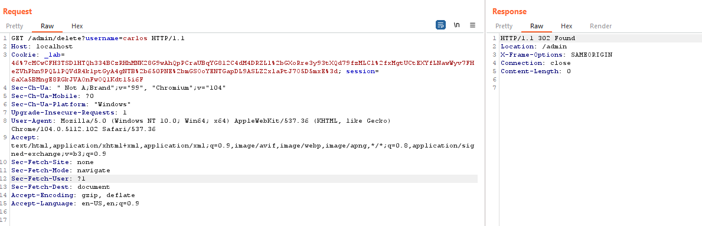

## Host header authentication bypass

1. Thử truy cập trang admin thì nhận được một message error là trang admin chỉ cho phép local user.

2. Sửa `host` header trong request `GET /admin` thành localhost thì nhận thấy truy cập thành công trang admin.

3. Tới endpoint `admin/delete?username=carlos` để xóa user `carlos`

