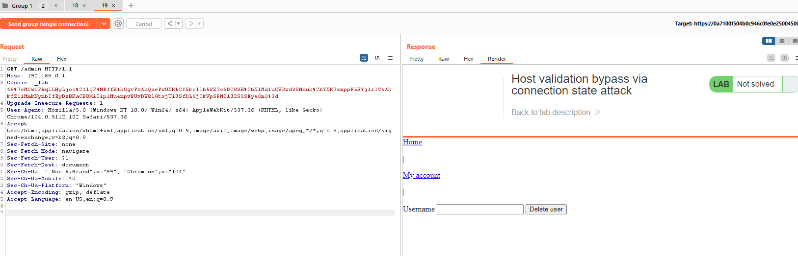
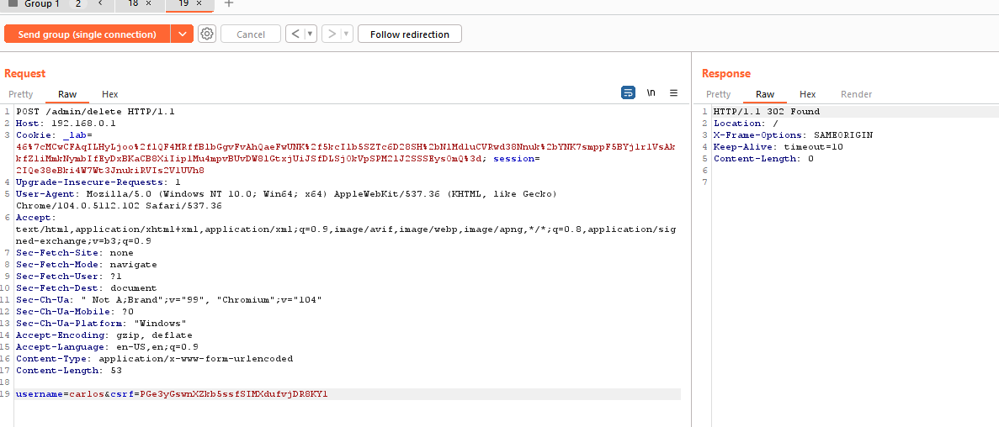

## Host validation bypass via connection state attack (REFER)

1. Ở lab này, Server chỉ thực hiện validation host header với request đầu tiên trong một connection nhất định.

2. Dùng send request in sequence(single connection) trong burp repeater để gửi lần lượt 2 request trong cùng một connection. -> request thứ 2 có thể access vào trang admin.

3. Craft request sau để thực hiện xóa user carlos

