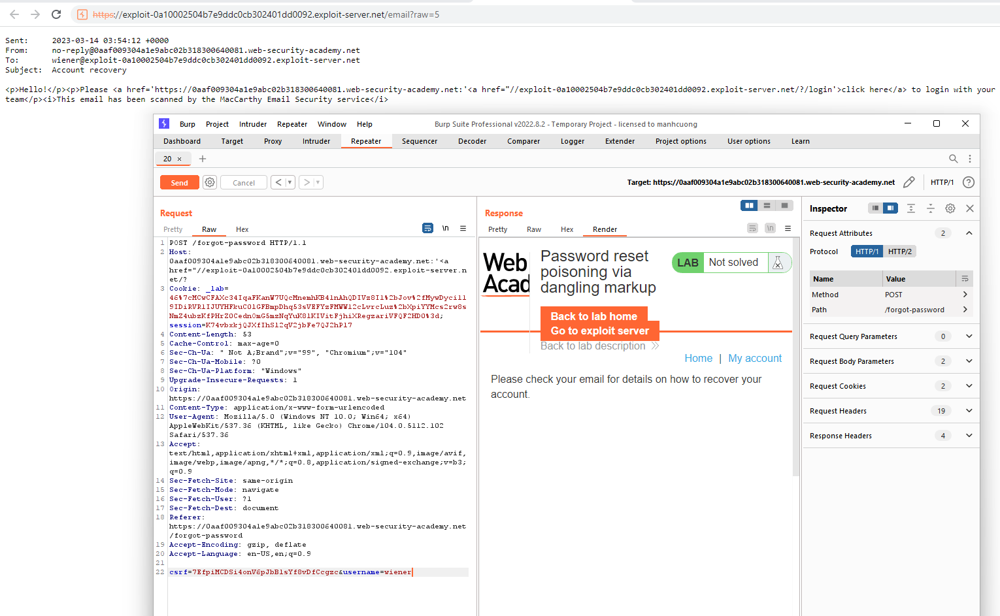
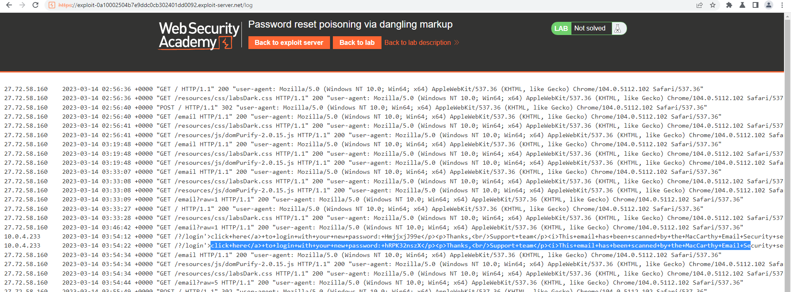

## Password reset poisoning via dangling markup(REFER)

1. Khi gửi một request quên mật khẩu thì trong mail server sẽ nhận được một mail chứa một link tới trang login và một mật khẩu được server generate. Ngoài ra content trong mail sử dụng DomPurify để sanitized ngăn không cho khai thác xss. 

2. Tuy nhiên ở option view raw để xem dạng html thì không dùng bất kỳ lib nào để sanitized. 

3. Khi thay đổi host thành các giá trị khác nhau đều bị lỗi gateway, nhưng khi thêm port bất kỳ vào thì response vẫn trả về bình thường.

4. Inject payload để render ra một email chứa đường link mà khi người dùng click vào content phía sau thẻ a sẽ được gửi tới exploit server của attacker. 

5. Trong exploit server vào access log tìm request khi mà victim click vào link chứa mật khẩu mới của `carlos`

