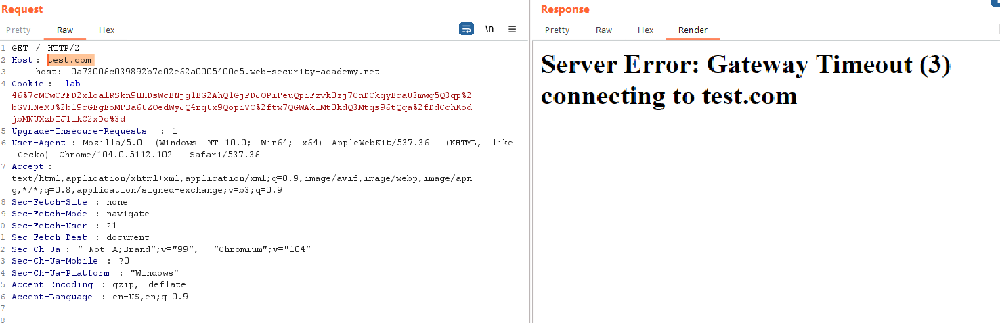
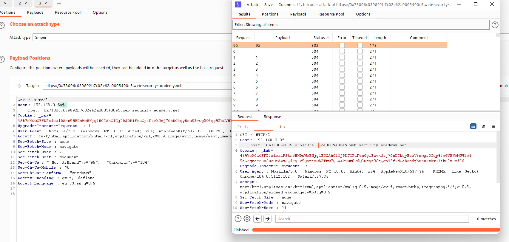
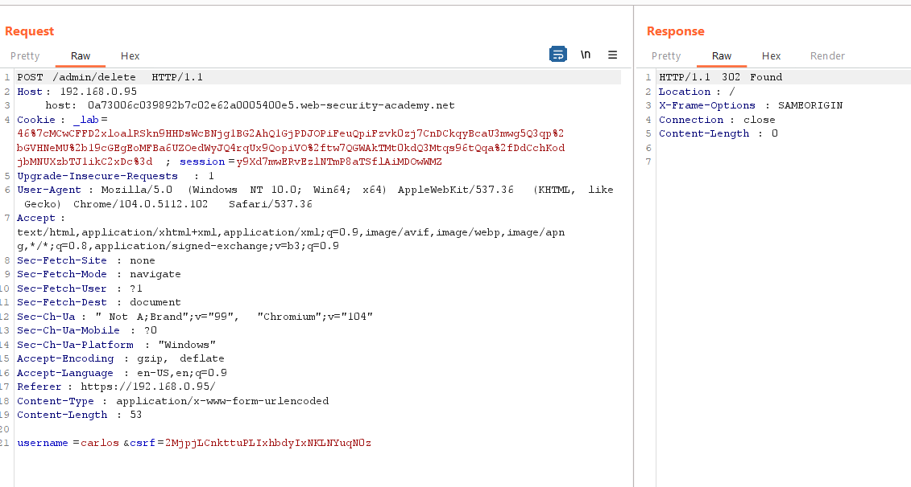

## Routing-based SSRF

1. Thử bypass `override` Host header bằng cách thêm line wrapping.

2. Có thể thấy server nhận được request có host là `test.com` và trả về message error.

3. Theo đề bài, lab này chứa lỗ hổng ssrf và trang internal admin có dải địa chỉ ip là 192.168.0.1/24. Tiến hành brute force để tìm địa chỉ ip của trang admin.

4. Nhận thấy với `Host = 192.168.0.95` response sẽ redirect tới trang `/admin`.

5. Craft request 

