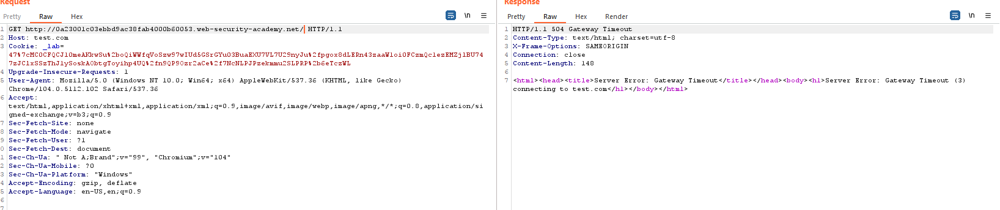
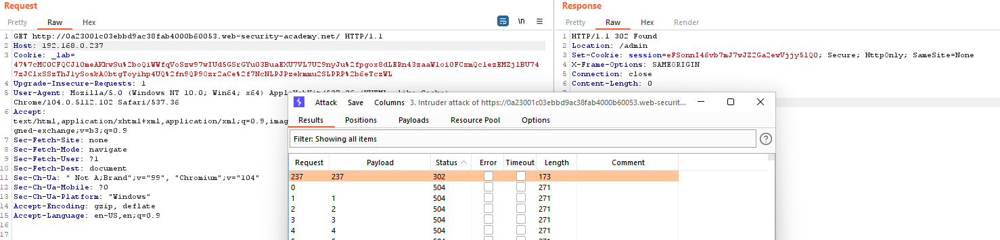
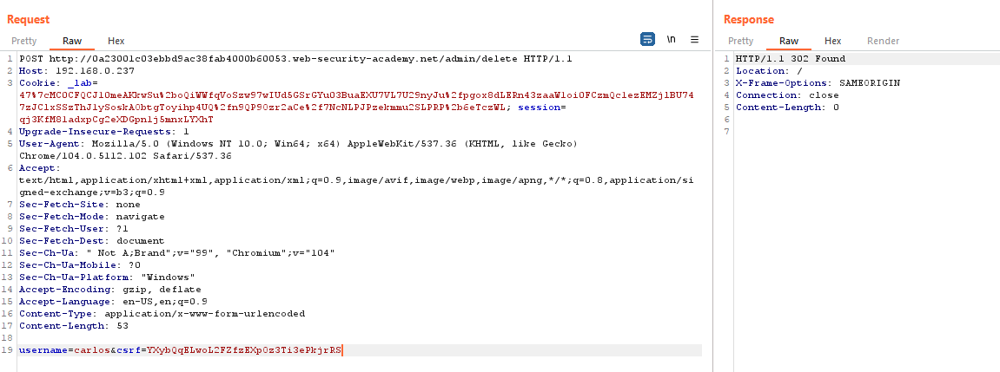

## SSRF via flawed request parsing

1. Bypass host header bằng cách cung cấp trực tiếp url trên request, response cho biết rằng server đã nhận giá trị host là `test.com`. 

2. Theo đề bài, trang admin có dải ip internal 192.168.0.0/24, tiến hành brute-force ip 

3. Sau quá trình brute-force, nhận được ip internal trỏ tới admin panel là `192.168.0.237`. Craft request xóa user yêu cầu cung cấp param `username` ,`csrf` + thêm session cookie.

