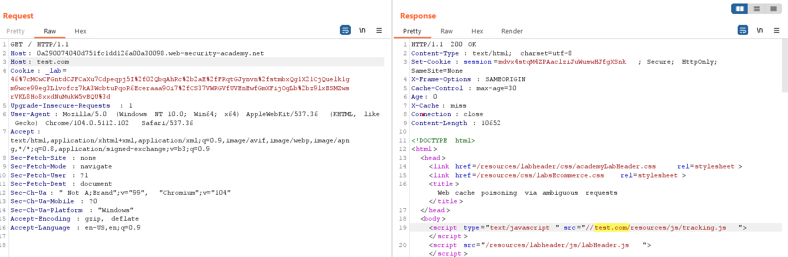
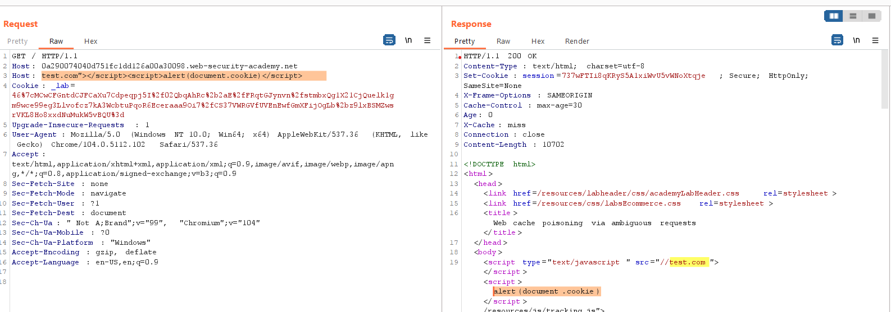

## Web cache poisoning via ambiguous requests

1. Thêm một header `Host` nữa rồi đợi cache hết hạn gửi request nhận thấy giá trị `Host` thứ 2 ghi đè lên `Host` 1 để rồi nó được reflect trên response.

2. Inject payload `test.com"></script>`

