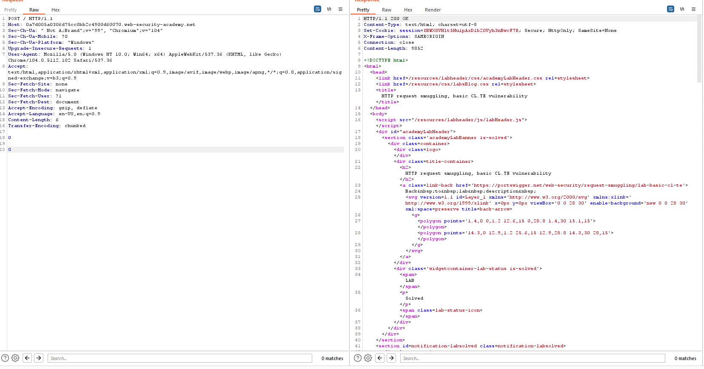
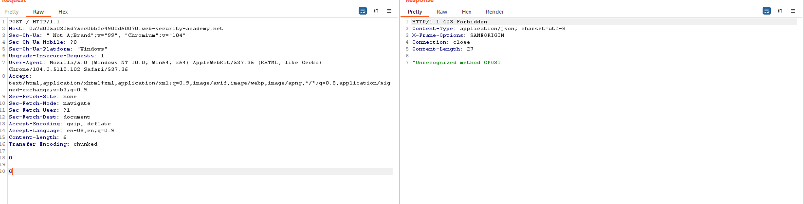

## HTTP request smuggling, basic CL.TE vulnerability

1. Được biết ở lab này có lỗ hổng http request smuggling với combo CL.TE.

2. Tiến hành thêm vào request body payload sau:
```

0

G
``` 

- Cùng với đó là thêm 2 trường CL và TE.



3. Khi gửi request phía front-end sẽ đọc hết content-length còn backend sẽ chỉ đọc hết ký tự `0` theo chuck. Phần còn lại của request sẽ được ghép với request phía sau. Gửi request thứ 2 ta được:



4. Với request thứ 2 ta nhận được message error cho biết request này được gửi với method `GPOST` do kết hợp với phần còn lại trong request trước.