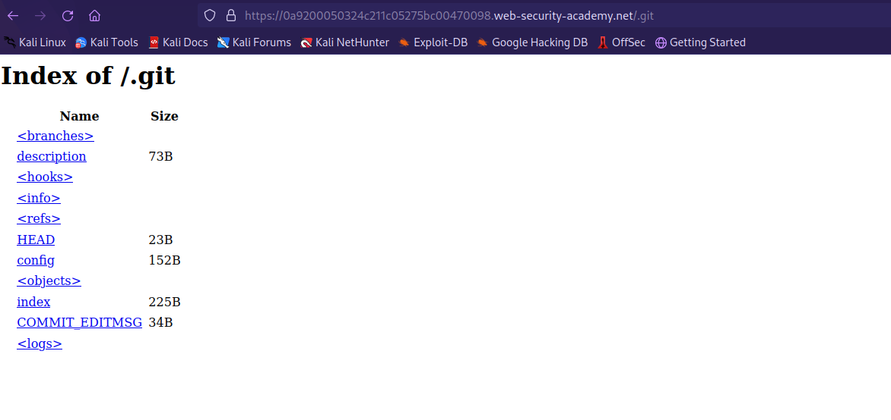
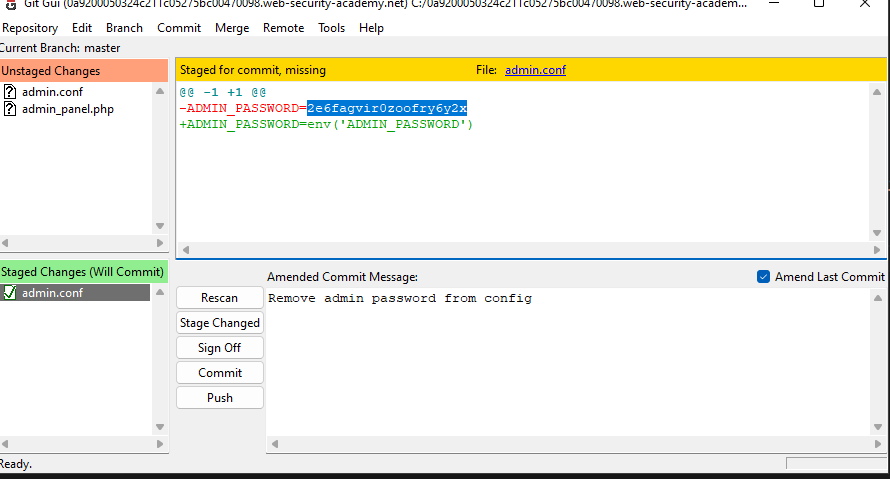

## Information disclosure in version control history (REFER)

1. Nhận thấy có thể truy nhập path ``/.git`` 



2. Tải toàn bộ file về bằng wget
- ```wget -r https://0a9200050324c211c05275bc00470098.web-security-academy.net/.git/```
3. Mở git, và xem commit history nhận thấy admin password trước khi bị xóa khỏi config



4. Đăng nhập vào ``administrator:2e6fagvir0zoofry6y2x`` rồi xóa user carlos