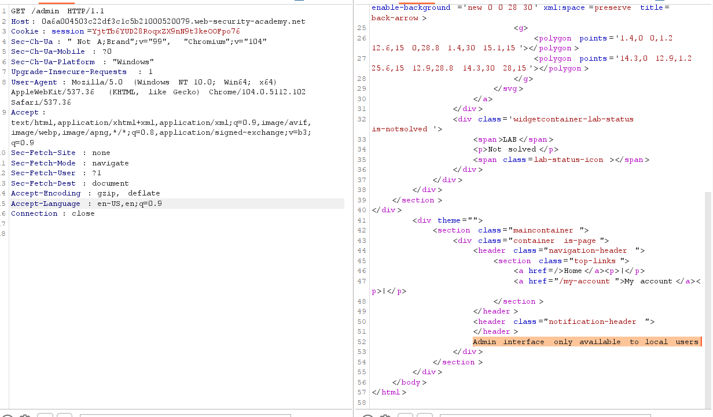
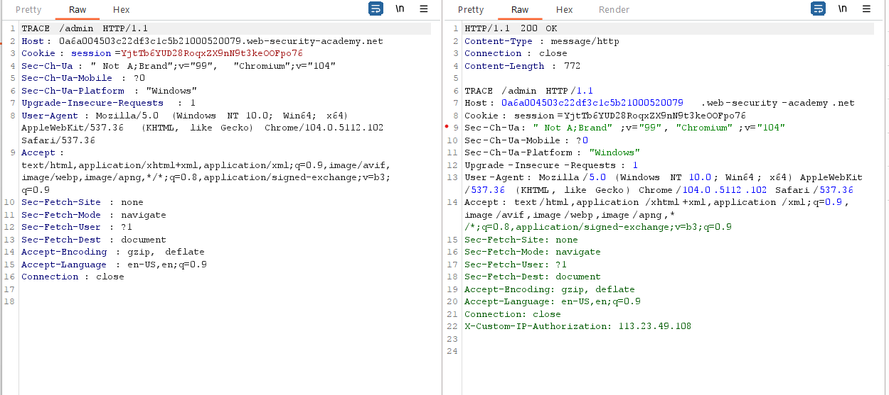
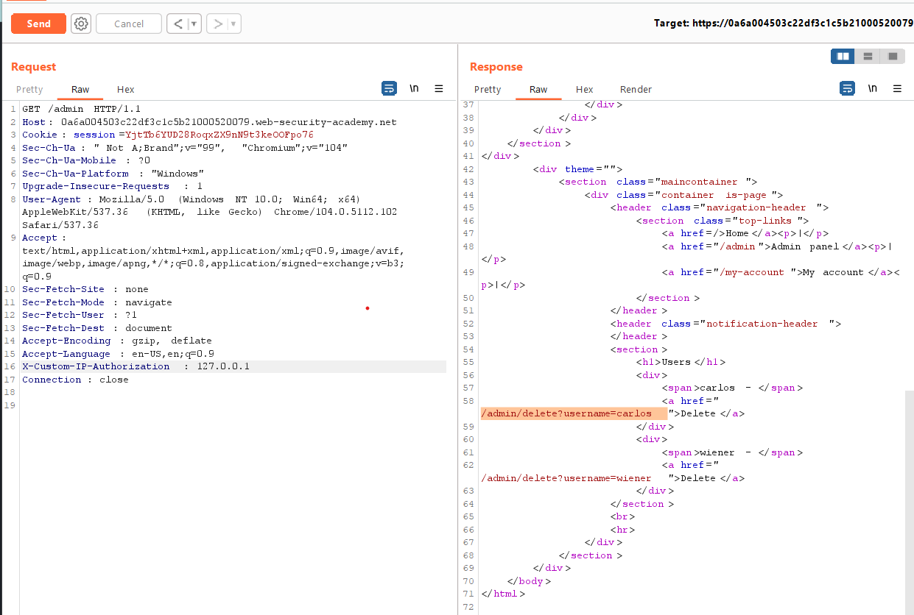

## Authentication bypass via information disclosure

1. Sau khi log vào ``wiener`` thử vào path ``/admin`` thì nhận được message là trang admin chỉ cho phép local user

2. Thử với từng method HTTP nhận thấy với method ``TRACE`` trả về response với phần comment khả nghi.

3. Nhận thấy ``X-Custom-IP-Authorization`` header có giá trị là địa chỉ ip của mình. Gửi lại request ``GET /admin`` + thêm header ``X-Custom-IP-Authorization : 127.0.0.1`` -> Truy nhập được vào trang admin

4. Gửi request ``GET /admin/delete?username=carlos`` để xóa user carlos