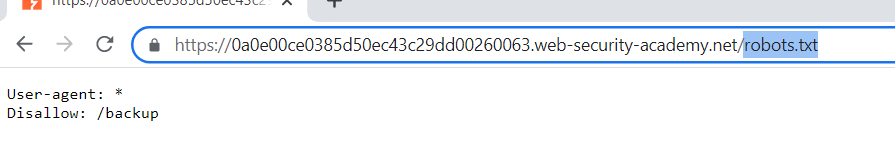
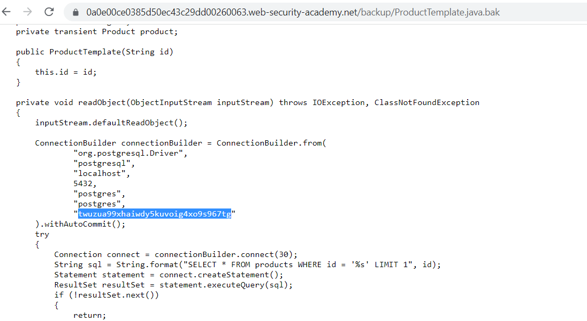

## Source code disclosure via backup files

1. Thử vào trang ``robots.txt`` ta nhận thấy có đường dẫn ``/backup``

2. Đi tới ``/backup`` ta có thể thấy đoạn mã config database và mật khẩu của db.

