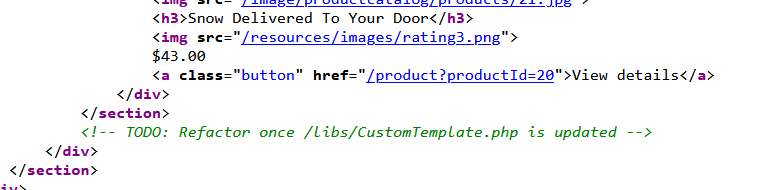
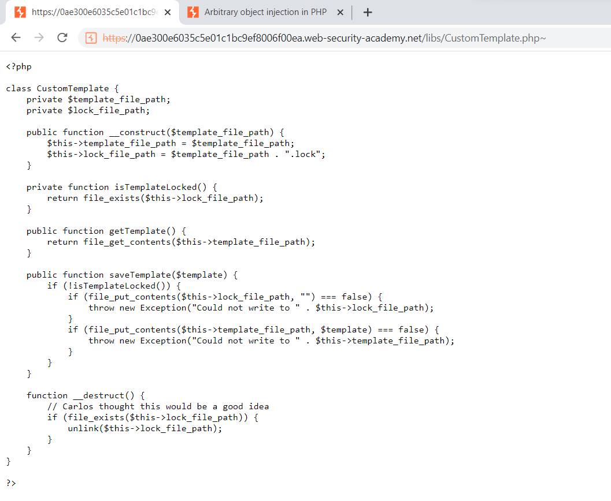
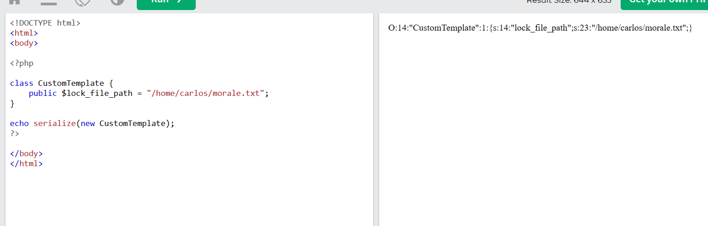
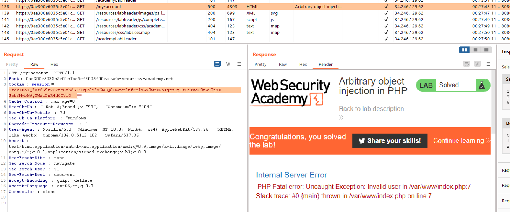

## Arbitrary object injection in PHP

1. Nhận thấy trong source code của lab có comment khả nghi 

2. Theo gợi ý từ đầu bài thêm ~ vào url, xuất hiện nội dung file php. Đọc code nhận thấy hàm `__destruct()` sẽ xóa file `lock_file_path` nếu mà file đó tồn tại.

3. Ta sẽ thử tạo một object `CustomTemplate` với giá trị của key `lock_file_path` trỏ tới file cần xóa rồi serialize nó. 

4. Cuối cùng encode base64 để gửi vào session cookie nhận thấy solved.

