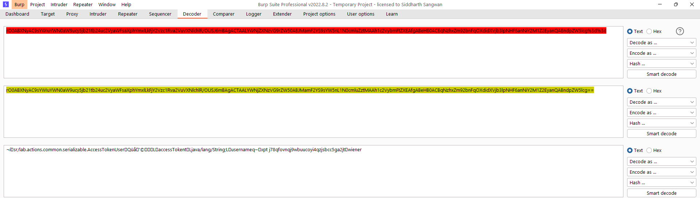
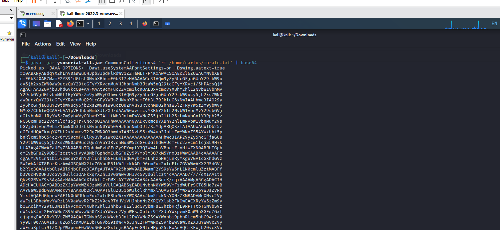
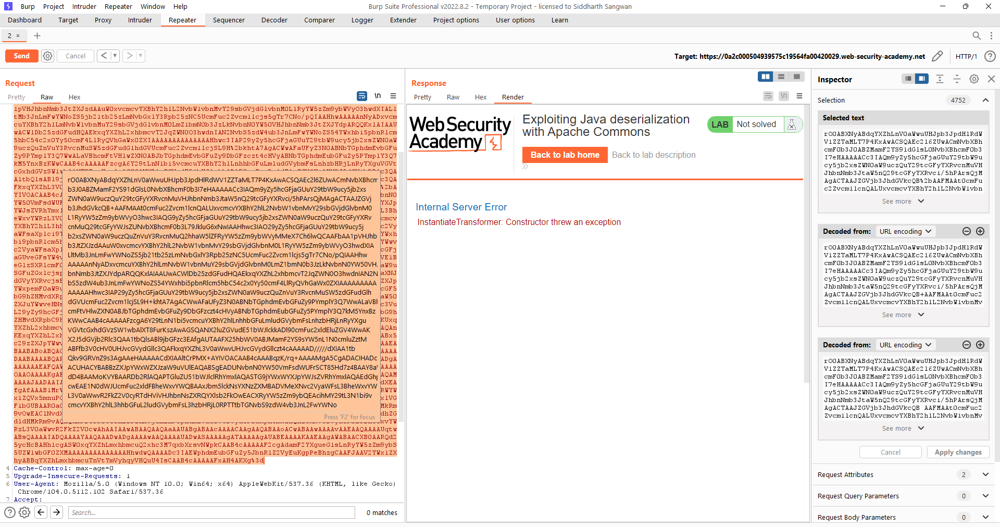

## Exploiting Java deserialization with Apache Commons

1. Theo như đề bài cho biết lab này sử dụng cơ chế session dựa trên serialization. Sau khi login vào account được cung cấp, phân tích session cookie trong burp decoder.

2. Từ đoạn text được decode có thể nhận thấy một số hàm trong java cùng với đó là thông tin đăng nhập của người dùng.

3. Sử dụng tool ``ysoserial`` để generate payload cho `CommonsCollection` theo như context academy.
- Execute: ``java -jar ysoserial-all.jar CommonsCollections4 'rm /home/carlos/morale.txt' | base64``

4. Thay giá trị của cookie session bằng payload trên. Trước đó url encode key character rồi send. 

-> Thành công