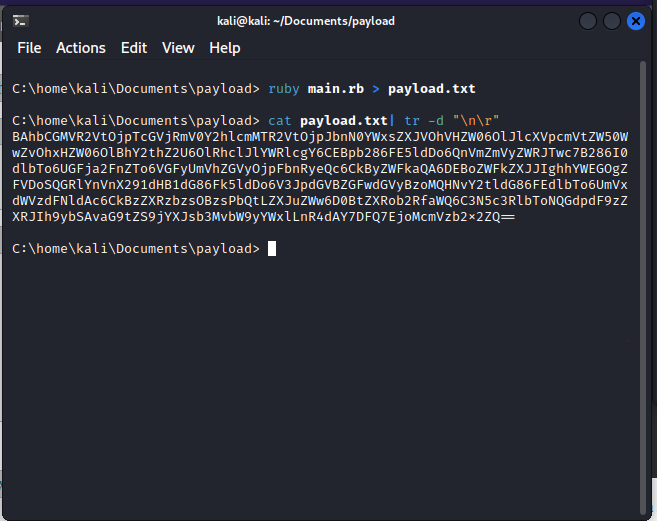

## Exploiting Ruby deserialization using a documented gadget chain (REFER)

1. Trang [devcraft.io](https://devcraft.io/2021/01/07/universal-deserialisation-gadget-for-ruby-2-x-3-x.html) là một gadget chain khai thác Ruby deserialization được ghi lại. Sửa command theo yêu cầu rồi thay payload đã encode base64 vào session cookie

