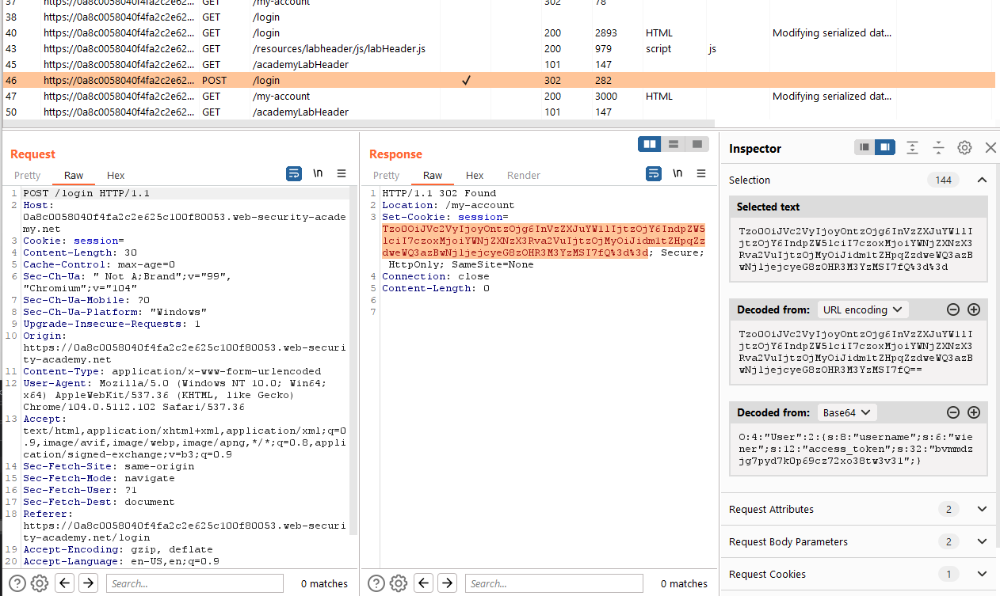
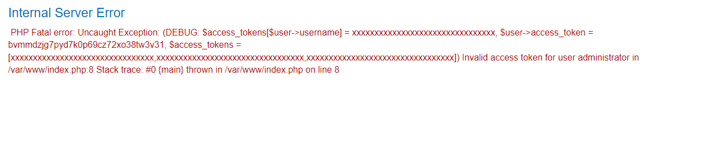
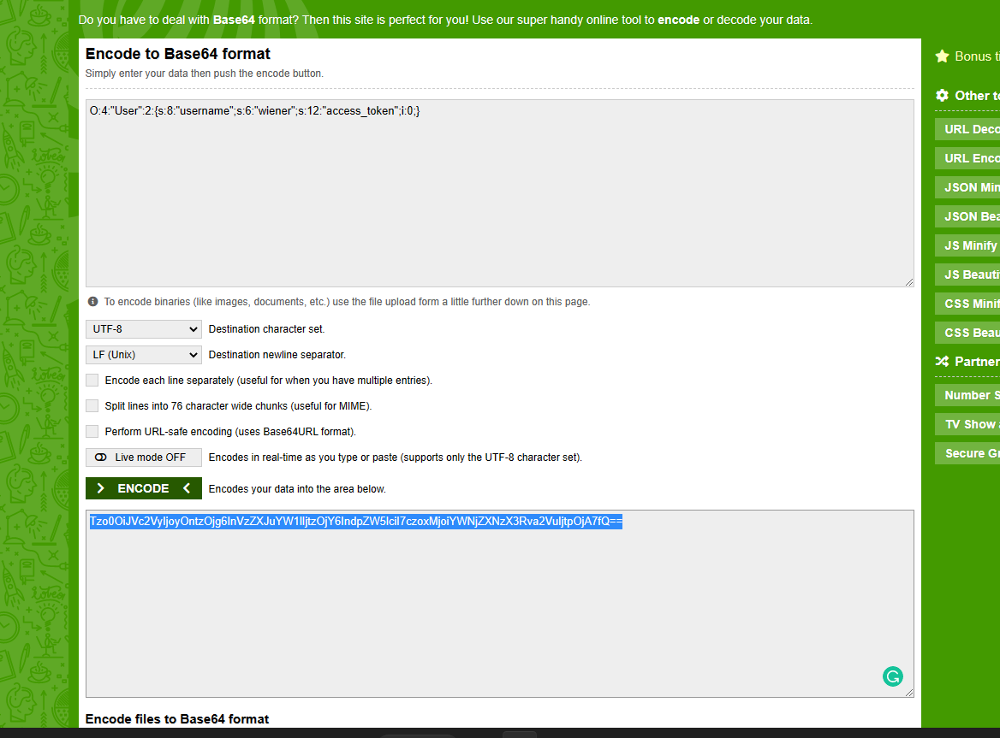

## Modifying serialized data types

1. Đăng nhập vào tài khoản được cấp, sau khi login xong server sẽ set cho ta một cookie có giá trị và url base64 encode của một serialized object.

2. Ngoài ra, từ đoạn debug ta cũng có thể thấy rằng backend đã so sánh string access_token ta cung cấp với string access_tokens của user có sẵn trên server bằng ==. Khi so sánh một chuỗi với một số, php sẽ convert string sang int với trường hợp trên khi string có giá trị đầu khác số thì nó sẽ convert thành số 0. 

3. Chúng ta sẽ sửa serialized object của ban đầu thành 

4. Nhận thấy button admin panel. Click vào để xóa user carlos
