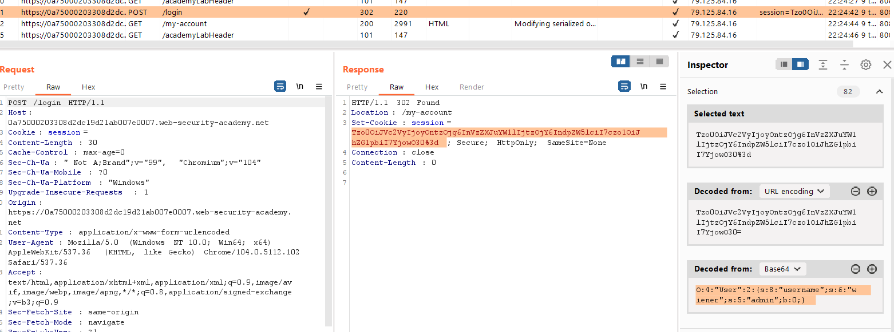
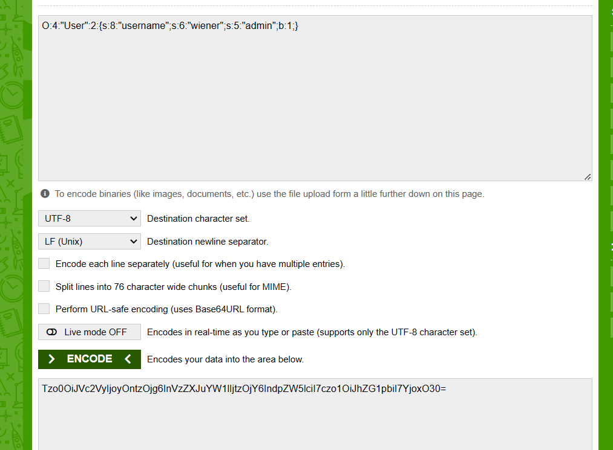
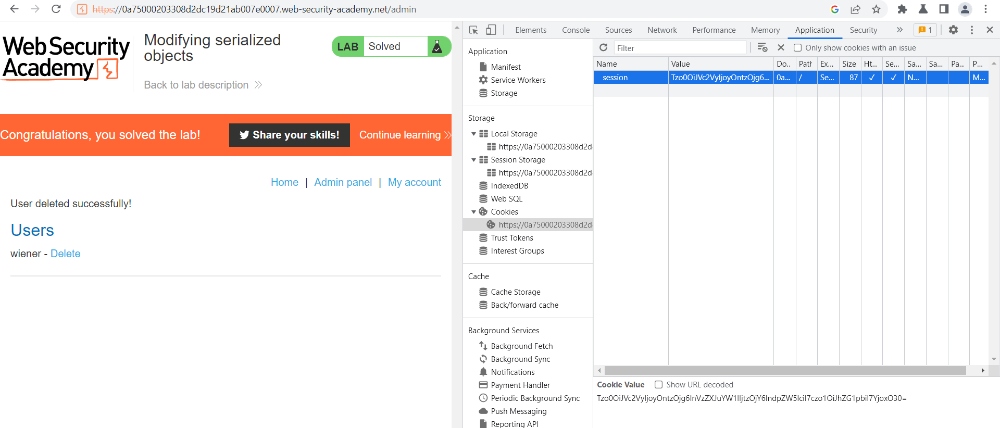

## Modifying serialized objects

1. Nhận thấy sau khi login vào tài khoản được cấp. Server sẽ set một cookie `session` có giá trị là base64 encode của một serialized object.

2. Modify đối tượng để giá trị của key `admin=1`. Rồi base64 encode serialized object đó ta được.

3. Edit cookie session rồi refresh thì thấy button admin panel

