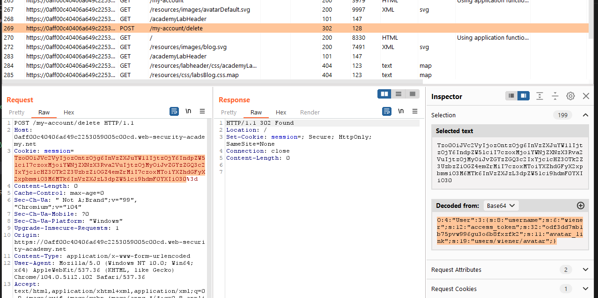
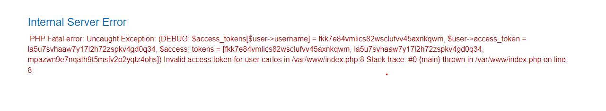
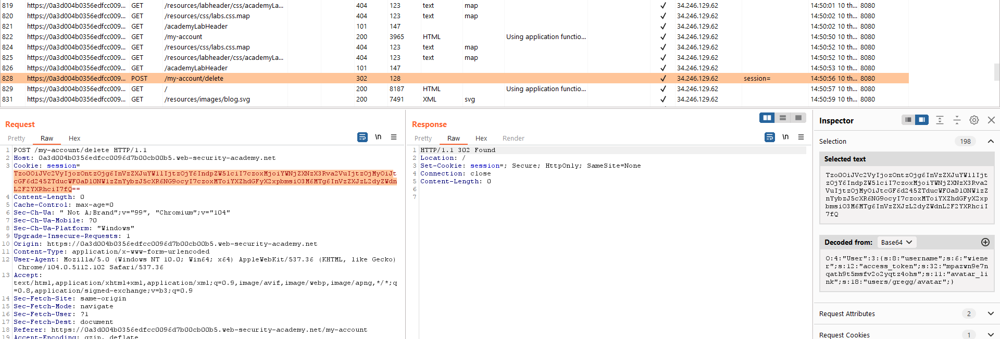
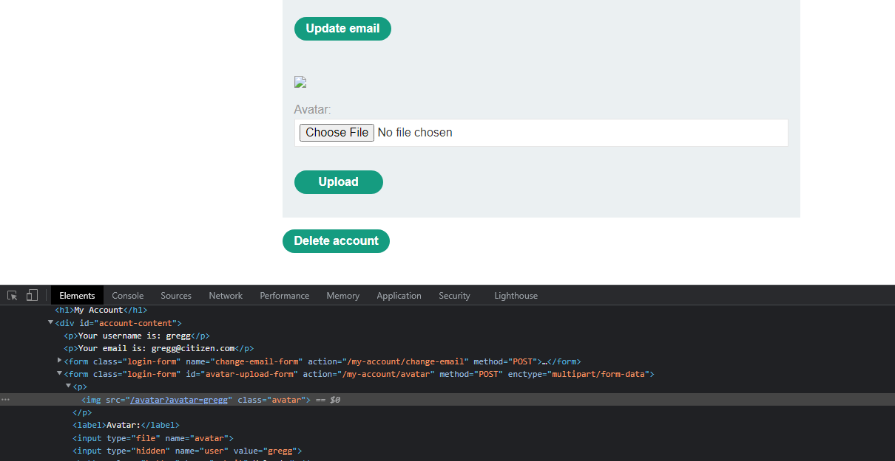
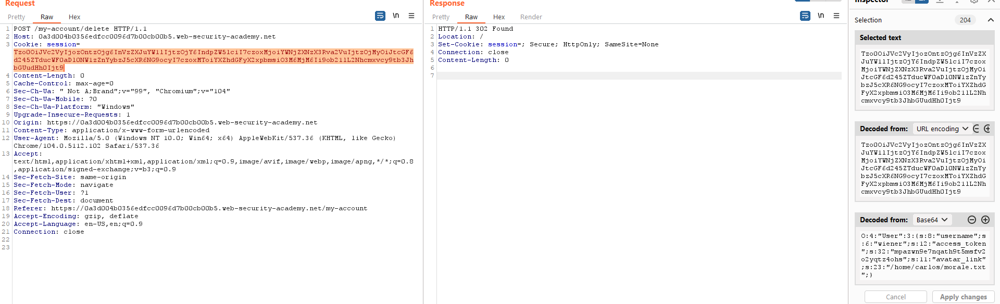

## Using application functionality to exploit insecure deserialization

1. Đăng nhập bằng tài khoản được cấp, sau khi login xong server sẽ set cho ta một cookie có giá trị và url base64 encode của một serialized object.

2. Tương tự như vậy đối với tài khoản ``gregg:rosebud``. Nhận thấy trong object User có cặp key - value chứa path tới folder avatar.

3. Tìm được access_token của carlos là: ``fkk7e84vmlics82wsclufvv45axnkqwm``

4. Tại mỗi acc upload một avatar. Đăng nhập vào account wiener bằng cookie có giá tri như sau: ``O:4:"User":3:{s:8:"username";s:6:"wiener";s:12:"access_token";s:32:"mpazwn9e7nqath9t5msfv2o2yqtz4ohs";s:11:"avatar_link";s:18:"users/gregg/avatar";}``. Xong rồi nhấn delete account.

5. Vào lại tài khoản gregg nhận thấy avatar not found. 

-> Như vậy kết luận rằng khi bấm button delete account thì giá trị file trong trường `avatar_link` cũng bị xóa.

6. Gửi POST request /delete vào burp repeater với giá trị cookie trỏ đến file cần xóa.

