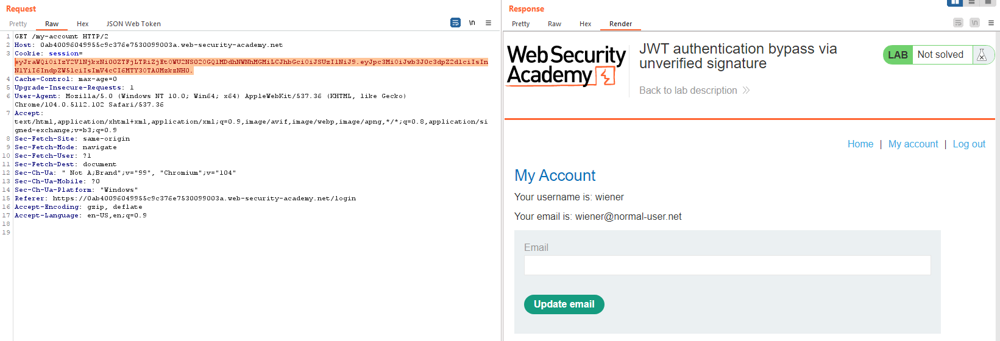
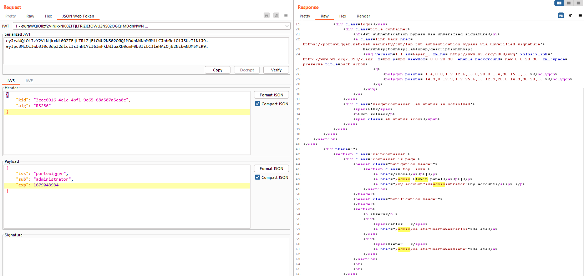

## JWT authentication bypass via unverified signature

1. Theo đề bài, ở lab này có lỗi thiết kế khi không xác thực signature. Khi ta thử xóa phần signature đi rồi gửi lại request thì server vẫn gửi lại response bình thường.

2. Truy cập vào `GET /admin` nhận được message là trang chỉ cho phép administrator account. 

3. Vào tab chỉnh sửa jws sửa giá trị `wiener` thành `administrator` -> nhận thấy truy cập thành công admin panel

4. Tạo request xóa user carlos.