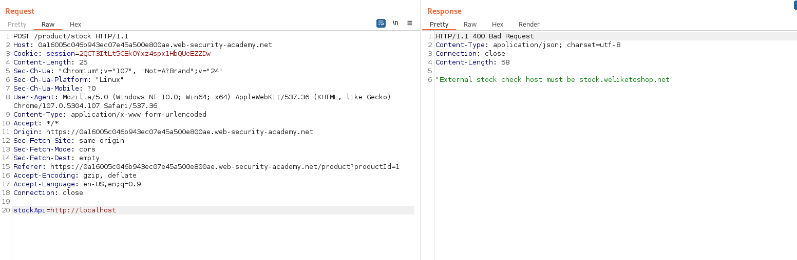
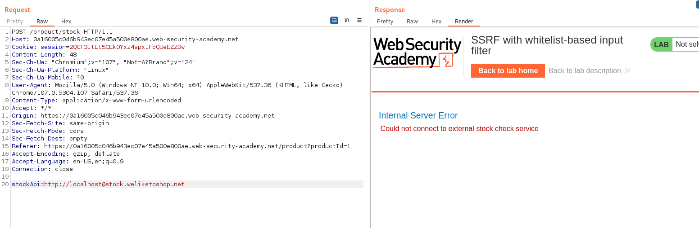
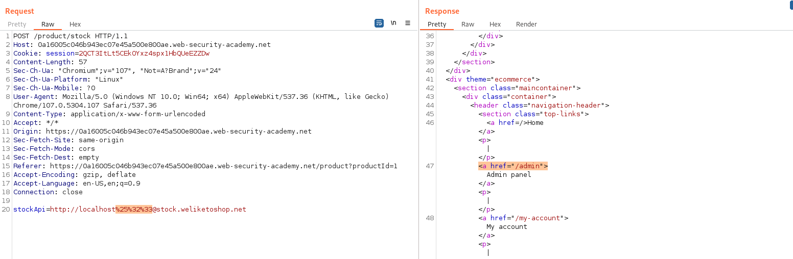

## SSRF with whitelist-based input filter (REFER)

1. Khi thử với payload ``http://localhost`` nhận được 1 response rõ ràng rằng host yêu cầu phải chứa ``stock.weliketoshop.net``.



2. Áp dụng lý thuyết ta sẽ thử với payload ``http://localhost@stock.weliketoshop.net`` để bypass validate yêu cầu phải chứa ``stock.weliketoshop.net``. 



3. Tiếp đến cố thêm `#` vào trước `@` để biến đoạn sau thành 1 fragment. Thử với payload ```http://localhost#@stock.weliketoshop.net``` thì thấy có vẻ # cũng đã bị block -> Thử double URL encode `#` thì thành công



4. Cuối cùng gửi payload ``http://localhost%25%32%33@stock.weliketoshop.net/admin/delete?username=carlos`` để hoàn thành lab