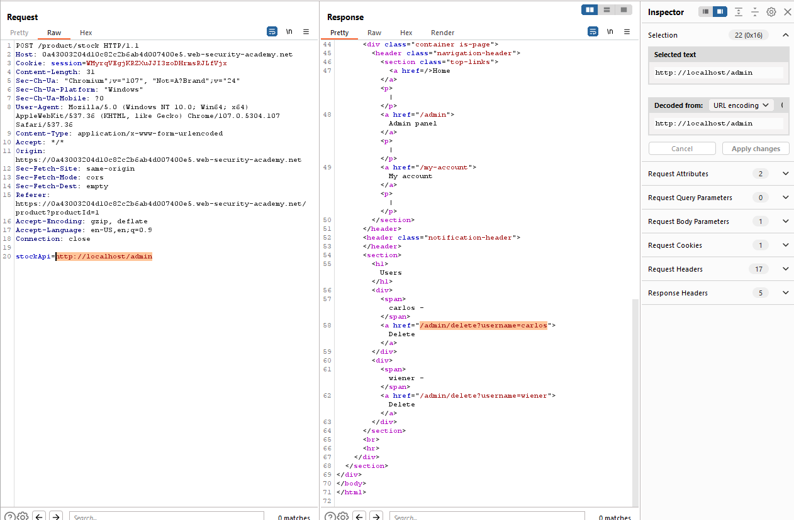
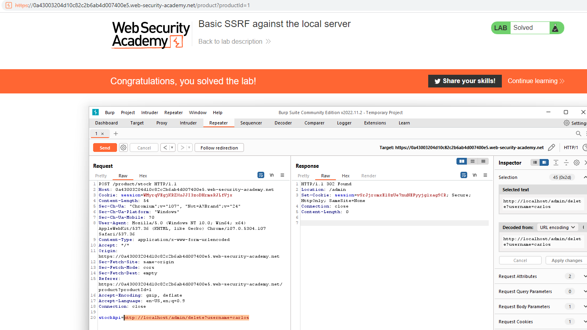

## Basic SSRF against the local server

1. Nhận thấy trong chức năng check stock, sẽ tạo 1 request với param ``stockApi`` có giá trị trỏ đến 1 url để lấy dữ liệu.

2. Đổi lại giá trị của ``stockApi`` thành ``http://localhost/admin`` để fetch dữ liệu trang admin

3. Thay url bằng url để xóa ``carlos`` user.

