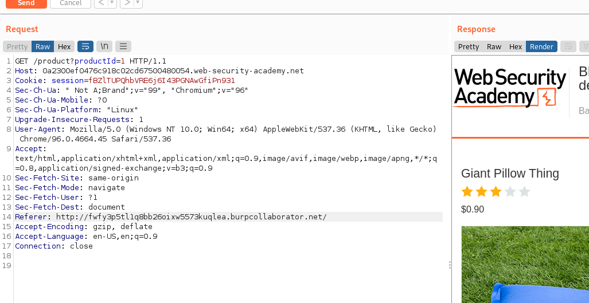
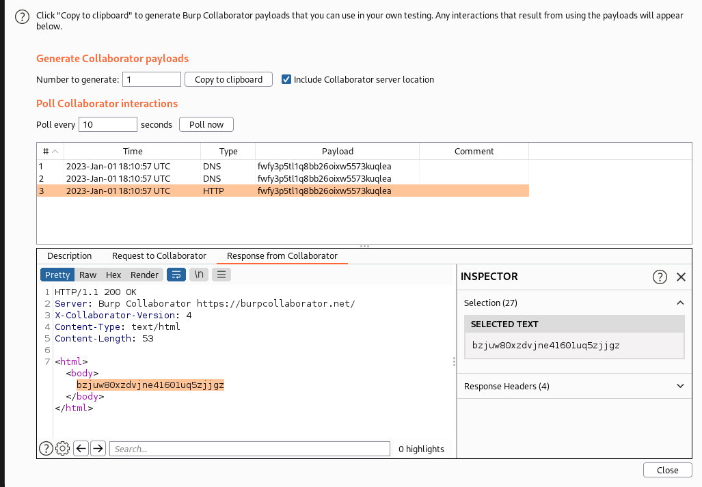

## Blind SSRF with out-of-band detection

1. Theo như mô tả của lab, ta biết website sẽ fetch URL ở ``Referer`` header khi request đến trang sản phẩm.

2. Thay ``Referer`` header thành url của burp collaborator thì nhận được request từ lab về  collaborator và nhận được tương tác lại

