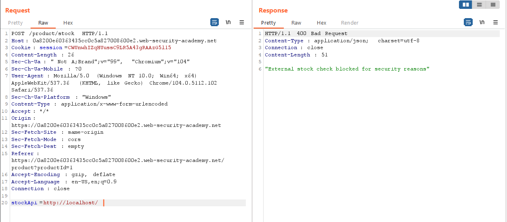
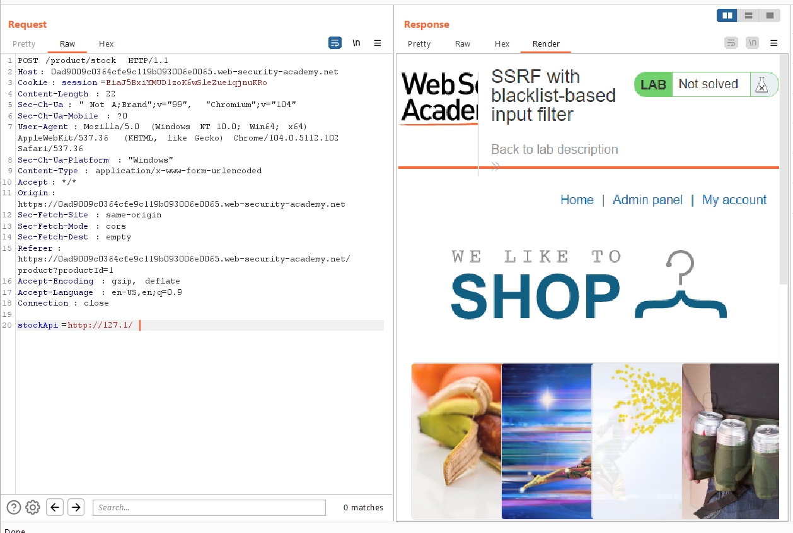
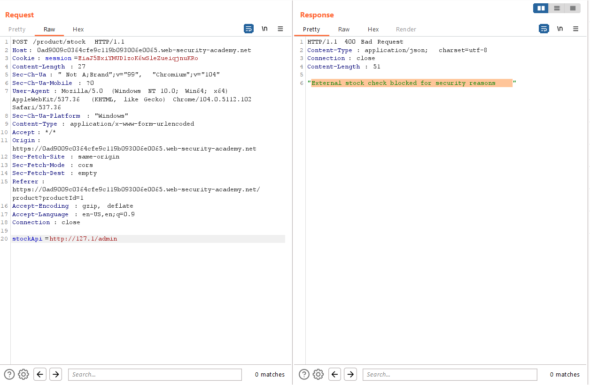
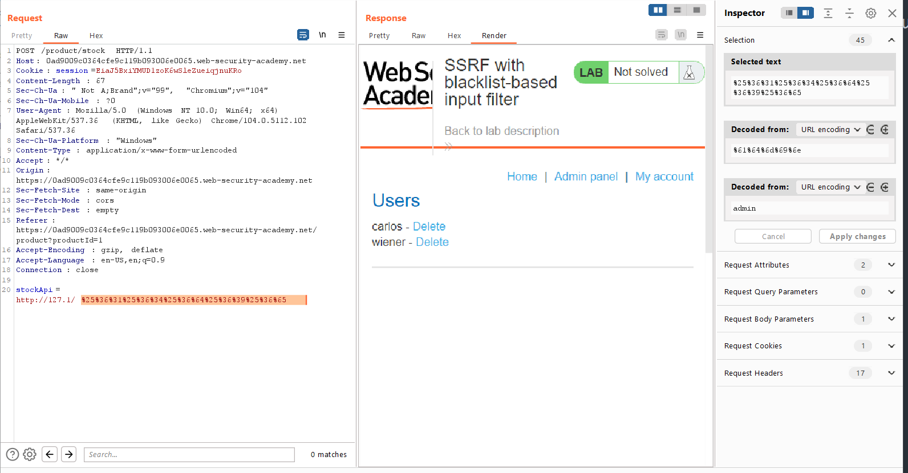

## SSRF with blacklist-based input filter

1. Ở lab này, đã được bổ sung thêm chức năng filter input dựa theo black_list để chống SSRF

2. Thử thay url thành ``http://127.1/`` được.

3. Truy cập admin panel với path ``/admin``

4. ``admin`` cũng bị block. URL encode ``admin`` 

5. Nhận thấy phải double encode thì mới bypass được

6. Lấy url delete user ``carlos`` rồi double encode trước khi gửi.