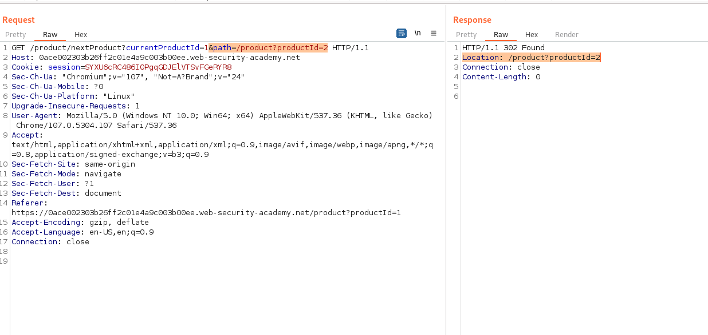
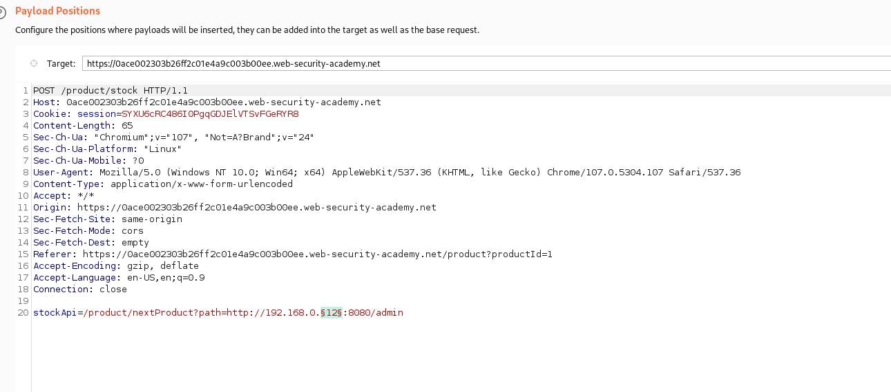
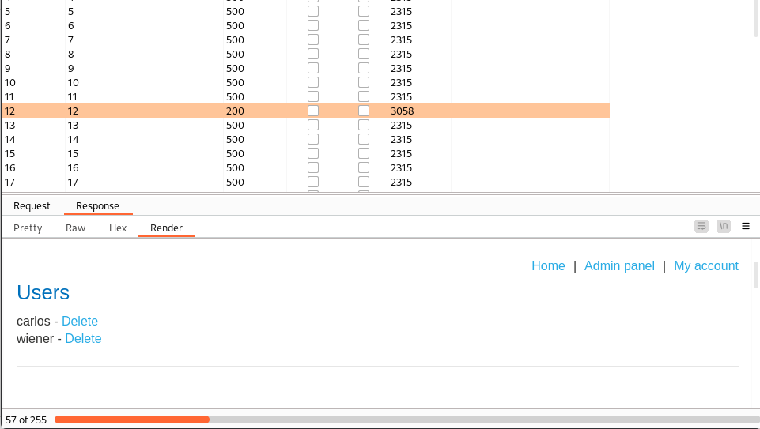

## SSRF with filter bypass via open redirection vulnerability

1. Nhận thấy trong response của chức năng ``next product`` header ``Location`` có giá trị của param ``path`` trong request



2. Do vậy ``path`` param có thể sẽ redirect về trang admin. Chuyển tới ``intruder`` để xác định ip liên kết.



3. Nhận thấy với địa chỉ ``192.168.0.12`` có status code = 200 và response được redirect tới trang admin



4. Lấy href delete của carlos -> payload: ```/product/nextProduct?path=http://192.168.0.12:8080/admin/delete?username=carlos```