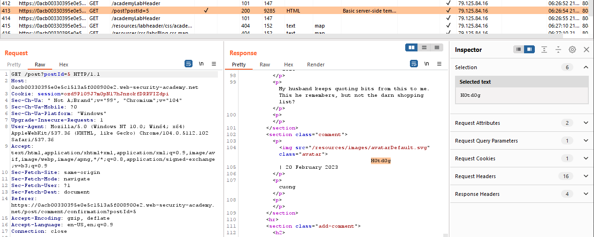

## Basic server-side template injection (code context)

1. Theo hint từ đầu bài, ta sẽ để ý đến tính năng tên yêu thích. Tìm output của giá trị preferred name.

2. Thử comment vào một post bất kỳ thì nhận thấy khi preferred name được set là nick name thì khi comment tên sẽ có giá trị `h0td0g`
-> Từ đó xác định được đầu ra của preferred name

3. Nhận thấy khi chọn preferred name thì client sẽ gửi một request với param `blog-post-author-display` 

4. Thử modify giá trị của param `blog-post-author-display` với cú pháp Tornado template.
- Payload: `{{7*'7'}}` nhận được response trả về là `{{7777777}}` 
- Payload: `7*'7'` nhận được response trả về là `7777777`

-> Từ đó có thể thấy giá trị của param `blog-post-author-display` rất có thể sẽ được bọc trong 1 khai báo template 

5. Craft payload sau:
- ``7*'7'}}{%25+import+os+%25}{{os.system('rm+/home/carlos/morale.txt'``

-> Solved thành công