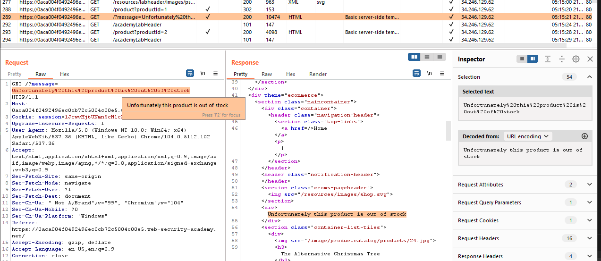
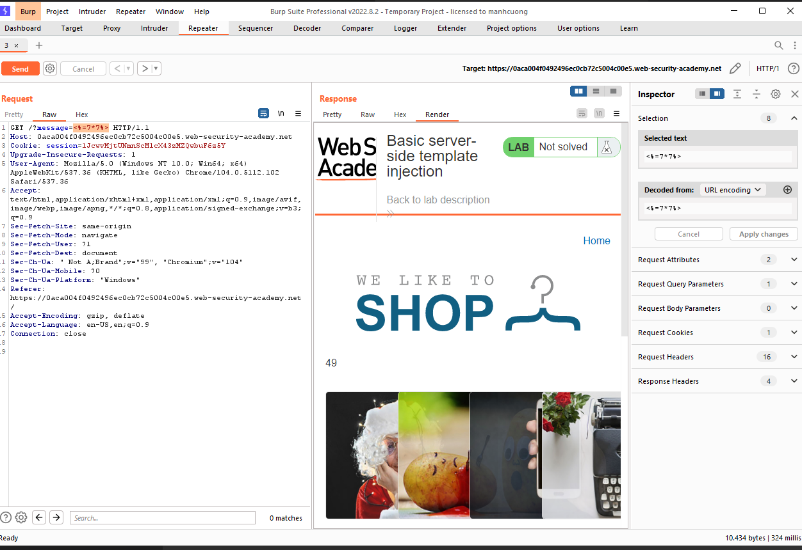
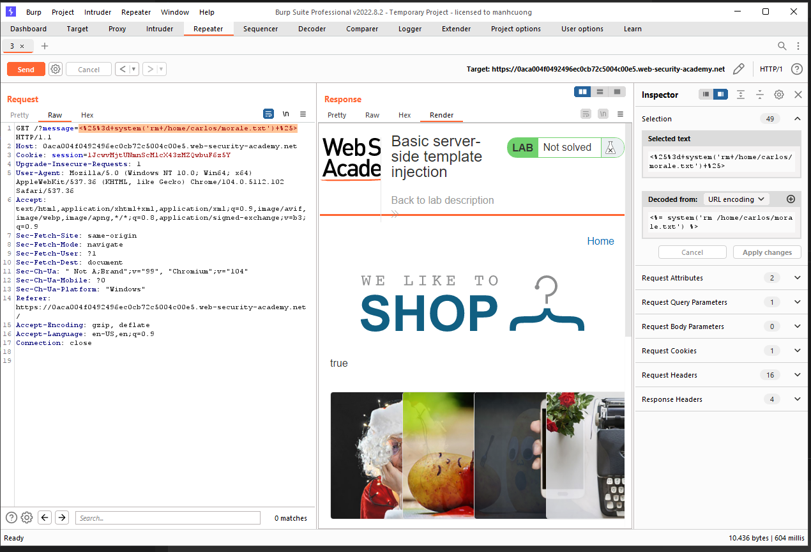

## Basic server-side template injection

1. Theo như yêu cầu đề bài, lab sử dụng ERB template của ruby. 

2. Khi vào thử một trang sản phẩm out of stock nhận được một req/res khả nghi khi message trong response trả về được fetch y nguyên với giá trị của param message trong url.

3. Sử dụng syntax của ERB template để identify lỗ hổng.
- Payload:  ``<%=7*7%>``

-> Kết quả của phép tính hiện ra trong message

4. Sử dụng hàm system trong ruby để thực hiện xóa file ``morale.txt``

