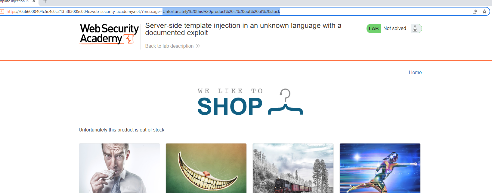
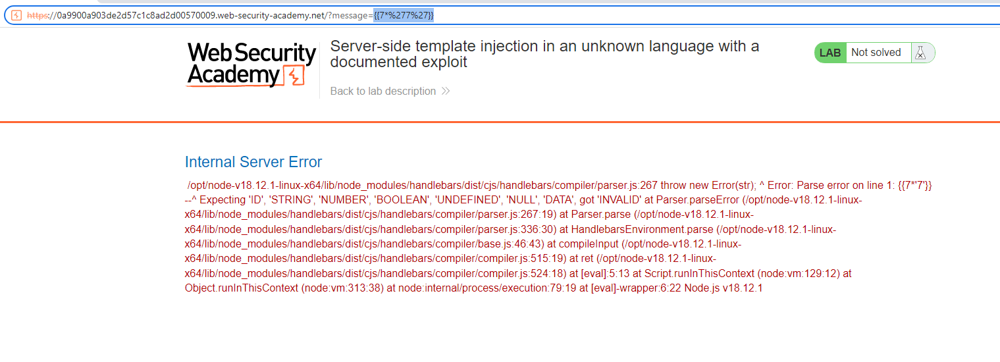
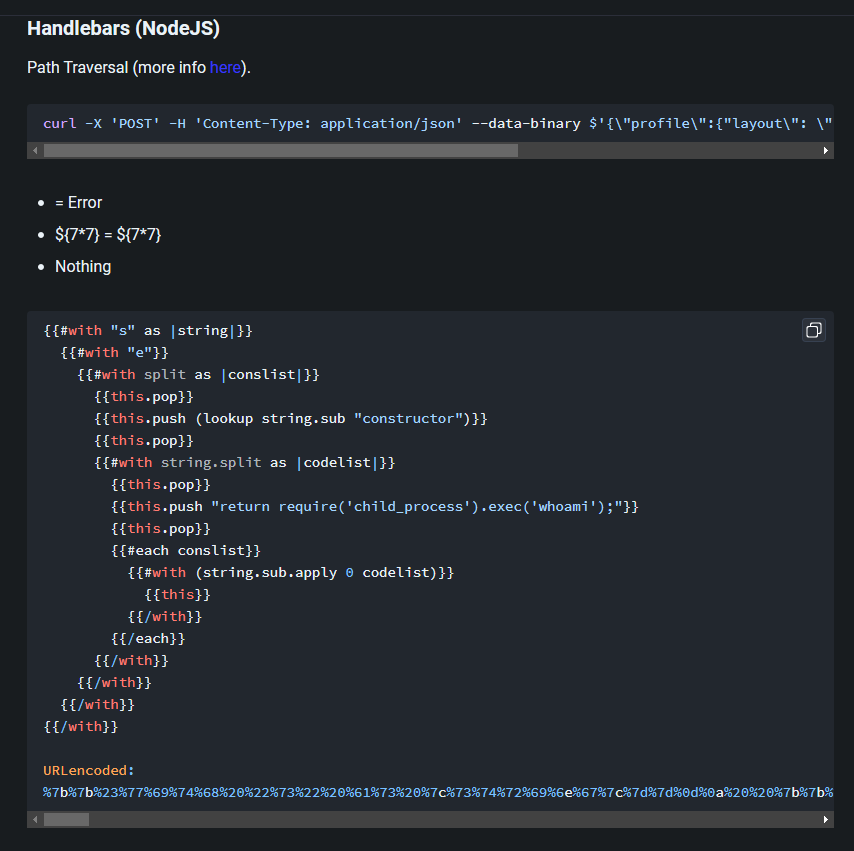
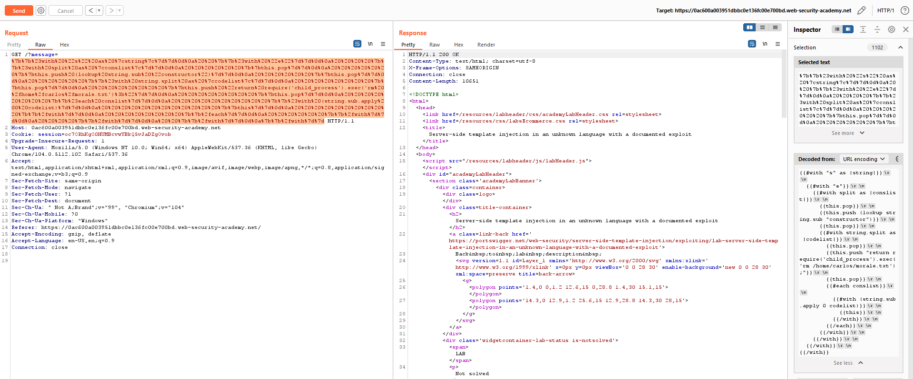

## Server-side template injection in an unknown language with a documented exploit

1. Khi vào thử một trang sản phẩm out of stock nhận được một req/res khả nghi khi message trong response trả về được fetch y nguyên với giá trị của param message trong url.

2. Sử dùng payload sau:
- Payload: `{{7*%277%27}}`

-> Nhận thấy lab sử dụng handlebars template của nodejs

3. Search được payload giúp thực thi RCE 

4. URL encode và gửi 

-> Thành công