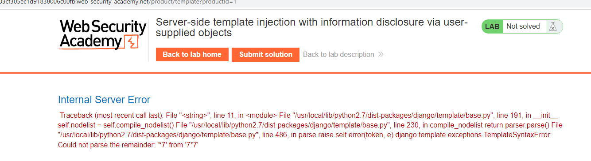
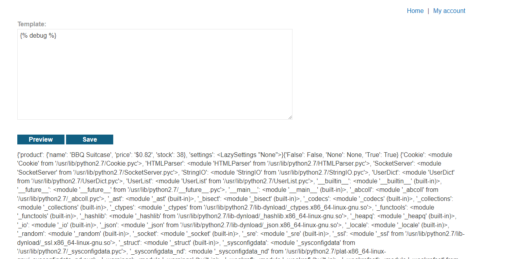
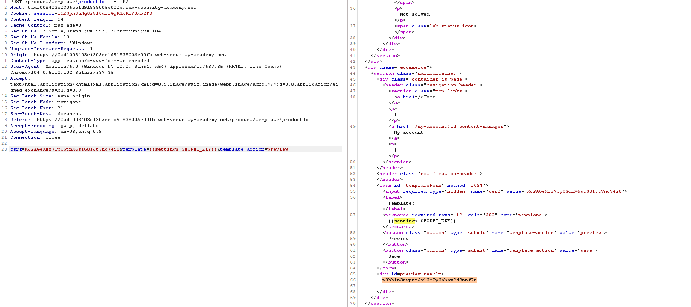

## Server-side template injection with information disclosure via user-supplied objects (REFER)

1. Phát hiện được lab sử dụng django template khi fuzz

2. Gọi đến build-in debug để xem từ template có thể truy xuất đến những object nào

3. Trong đó `settings` object chứa trường `secret-key`. Goij đến đó để lấy key ->submit

