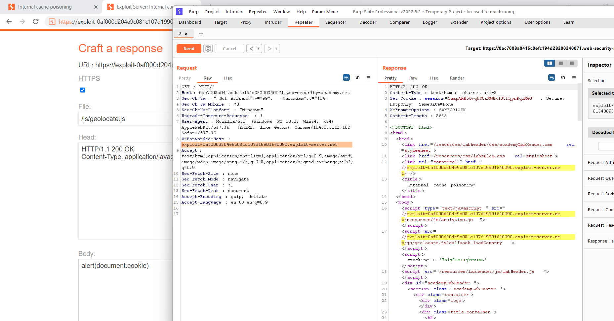

## Internal cache poisoning

1. Dùng tool Param Miner xác định được ``X-Forwarded-Host`` là một unkeyed param.

2. Với một host bất kỳ nhận thấy nó sẽ được gán thêm vào trước link import js file. Để `X-Forwarded-Host` là trang exploit rồi craft trang exploit thành path sau khi inject

