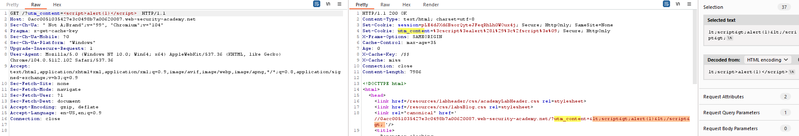
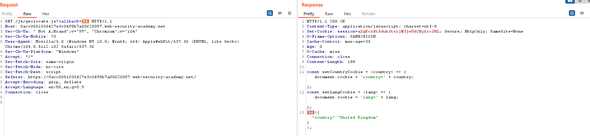
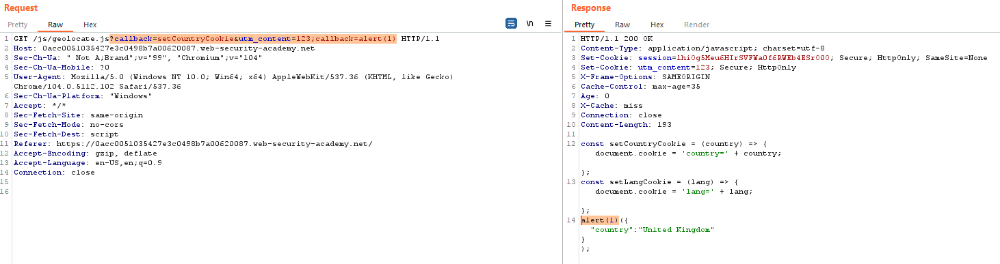

## Parameter cloaking

1. Dùng param miner phát hiện tham số `utm_content` là unkeyed param. Tuy nhiên không thể inject payload vào response do lab đã escape dấu `<>`

2. Nhận thấy trong http history có một file js có param `callback` và cũng sử dụng web cache.

3. Khi thay một giá trị bất kỳ cho param `callback` nhận thấy nó được reflect trong response js trả về 

4. Sử dụng unkeyed param `utm_content` kết hợp với dấu `;` để bypass sự khác nhau giữa phía backend với cache về phân chia giữa các tham số.
- Payload: ``?callback=setCountryCookie&utm_content=123;callback=alert(1)``

<!-- 5. Phía backend thì hiểu là có 3 tham số trong đó tham số callback bị trùng nên sẽ lấy giá trị của tham số cuối cùng. Còn trong cache hiểu là có 2 tham số là callback=setCountryCookie và utm_content=123;callback=alert(1) và do utm_content là unkeyed param nên response này sẽ được lưu vào cache và khi victim access GET /js/geolocate.js/?call=setCountryCookie thì sẽ malicious-->