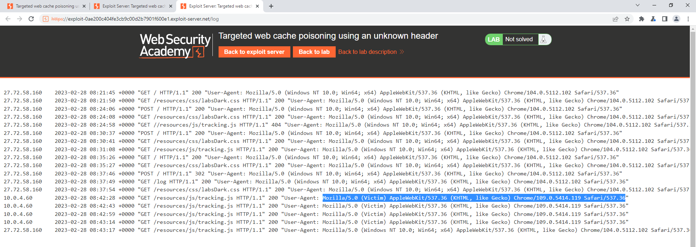
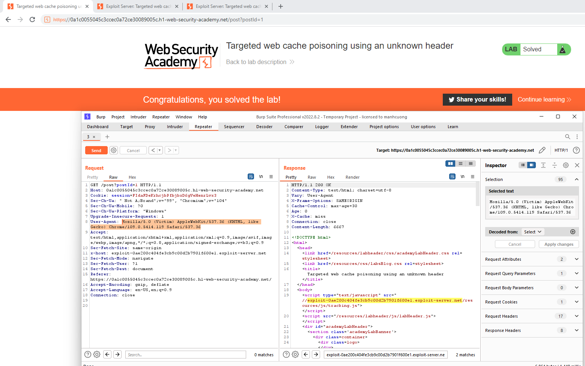

## Targeted web cache poisoning using an unknown header

1. Sử dụng tool param miner trong burp suite để xác định unkeyed header.

2. Xác định được 2 header `origin` và `x-host` là unkeyed input. Khi thử cho x-host một giá trị bất kỳ nhận thấy giá trị đó được reflect lại trong response 

3. Craft trang exploit để endpoint là `/resources/js/tracking.js` và body có nội dung: `alert(document.cookie)` để khi load trang comment sẽ include file `tracking.js` trên exploit server.

4. Ngoài ra trường `Vary` còn cho chúng ta biết header `User-Agent` là một key cache, do đó khi cùng một request nhưng có giá trị của `User-Agent` header khác nhau thì sẽ phân biệt với nhau. Bởi vì thế mà khai thác chỉ thành công ở phía attacker.

5. Do victim sẽ đọc mọi comment nên ta sẽ gửi một comment với một tag html gửi một request đến trang exploit server để rồi bắt được log chứa thông tin victim.
- Payload : `<image src="https://exploit-0ae200c404fe3cb9c00d2b7901f600e1.exploit-server.net/resources/js/tracking.js"/>`

6. Trong access log của exploit server nhận được thông tin của victim với thông tin mà ta cần `User-Agent` header để khai thác  web cache poison

7. Thay đổi giá trị `User-Agent` trong request thành giá trị của victim 

