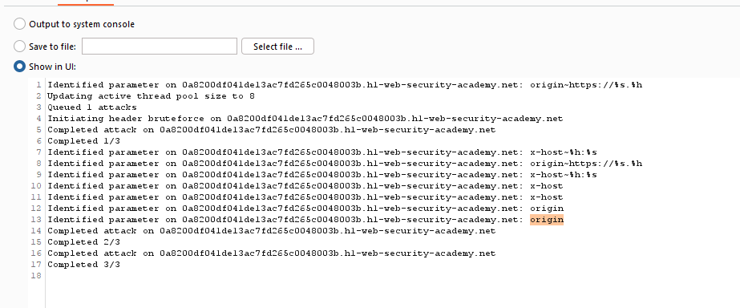
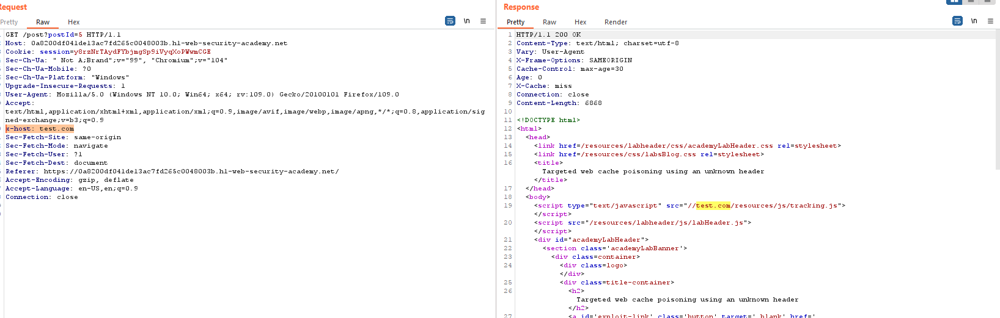

## Targeted web cache poisoning using an unknown header

1. Sử dụng tool param miner trong burp suite để xác định unkeyed header.

2. Xác định được 2 header `origin` và `x-host` là unkeyed input. Khi thử cho x-host một giá trị bất kỳ nhận thấy giá trị đó được reflect lại trong response 

3. Craft trang exploit để endpoint là `/resources/js/tracking.js` và body có nội dung: `alert(document.cookie)` để khi load trang comment sẽ 

4. 