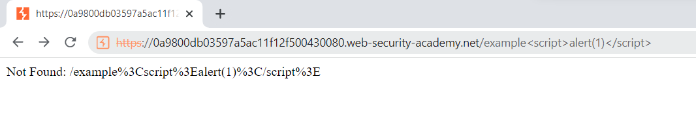
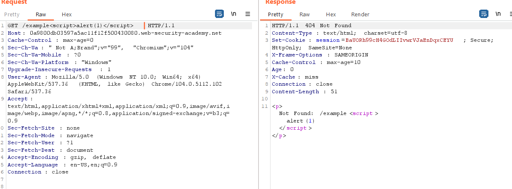

## URL normalization

1. Nhận thấy khi truy cập vào một path bất kỳ không tồn tại sẽ nhận được response báo not found và path ta truyền vào sẽ được reflect lại. 

2. Inject payload vào url thì thấy response trả về các ký tự đặc biệt bị url-encode 

3. Còn khi gửi request bằng burp repeater thì inject thành công.

4. Do đó ta sẽ tiến hành gửi request trong burp để lưu response chứa malicious vào cache. Và khi victim access url nó sẽ trả về response chứa mã khai thác thay vì chuyển tới phía server rồi url encode để generate ra một response khác.