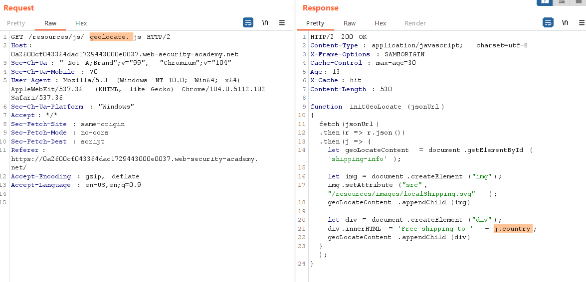
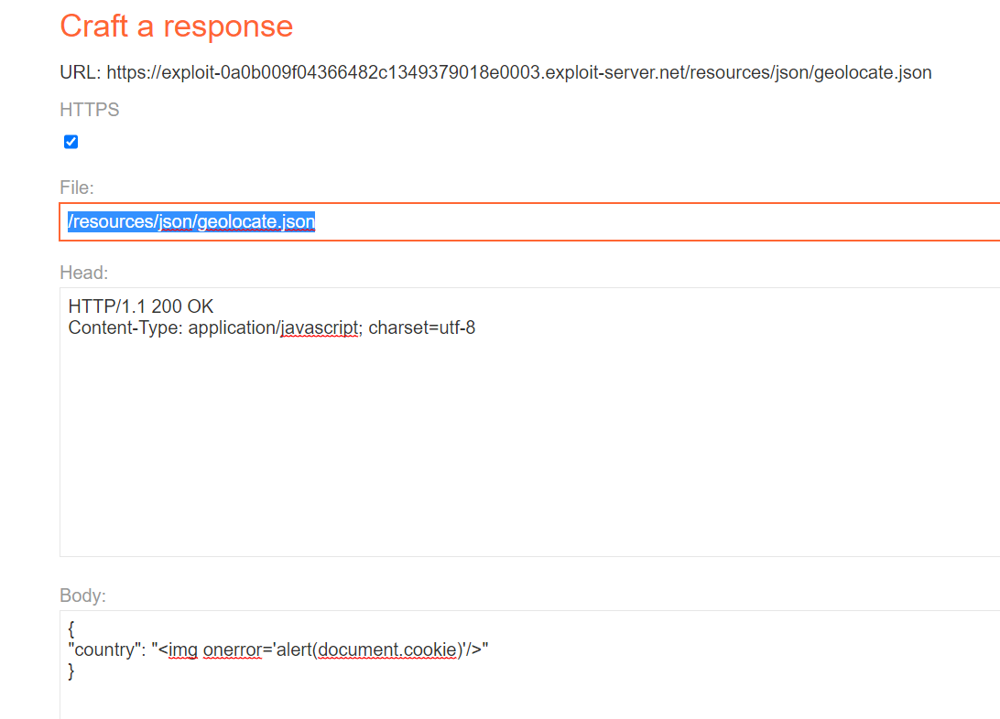

## Web cache poisoning to exploit a DOM vulnerability via a cache with strict cacheability criteria(REF)

1. Scan bằng param miner phát hiện header ``X-Forwarded-Host`` là một unkeyed header. 

2. Khi thêm header ``X-Forwarded-Host`` vào nhận thấy nó được gán cho giá trị `data.host`.

3. Mà `data.host` là tham số đầu vào kết hợp cho hàm `initGeoLocate` trong `geolocate.js`. Trong đó nó sẽ reflect lại giá trị của `country` từ jsonUrl(param số đầu vào)

4. Đặt giá trị của header ``X-Forwarded-Host`` thành exploit host. Để hàm `initGeoLocate` có thàm số truyền vào là `https://exploit-0a0b009f04366482c1349379018e0003.exploit-server.net/resources/json/geolocate.json`. Sau đó craft trang exploit giá trị của country thành payload mong muốn. 

5. 