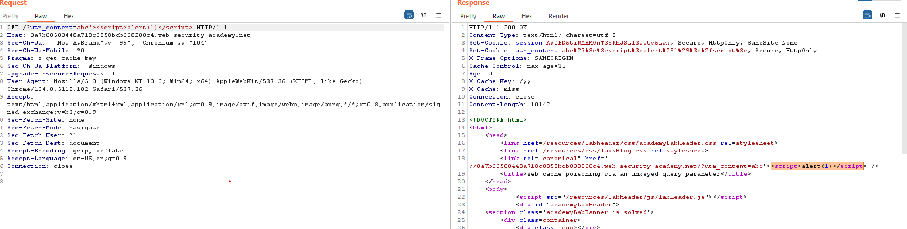

## Web cache poisoning via an unkeyed query parameter

1. Theo đề bài, ở lab này gần như các query parameter đều là cache key ngoại trừ một vài param.

2. Theo docs, ta biết được param `utm_content` thường bị exclude khỏi cache key list để phân tích phía backend

3. Thêm param trên vào query URL rồi chờ cho cache cũ hết hạn rồi gửi. Nhận thấy url được reflect lại trong response.

4. Inject payload sau để gửi vào cache response chứa mã khai thác
- Payload: ``?utm_content=abc'>``

