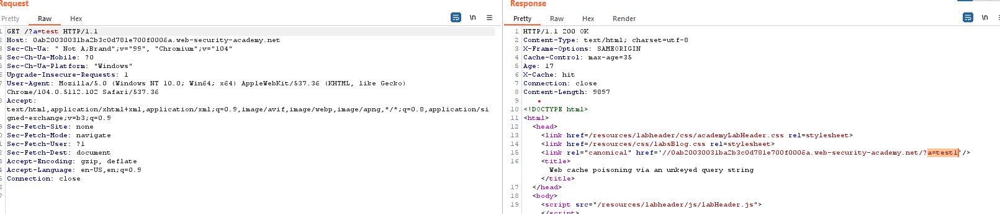
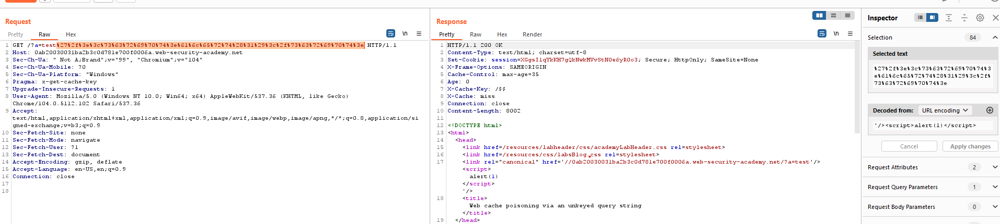

## Web cache poisoning via an unkeyed query string

1. Theo đề bài, query string là một cache unkeyed. Do đó với các query khác nhau nó sẽ không phân biệt.

2. Khi thử thêm một vài query nhận thấy nó được reflect lại trong response

3. Inject payload sau rồi url encode để solve lab:
- Payload: `'/>`

