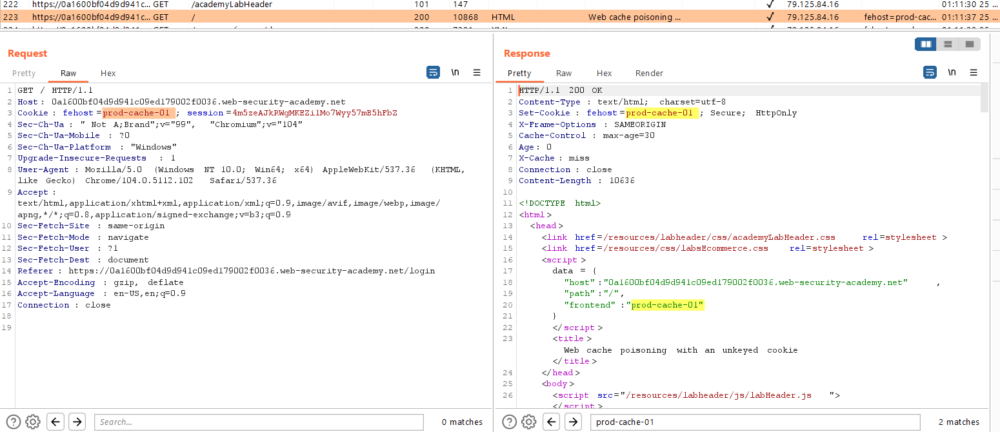
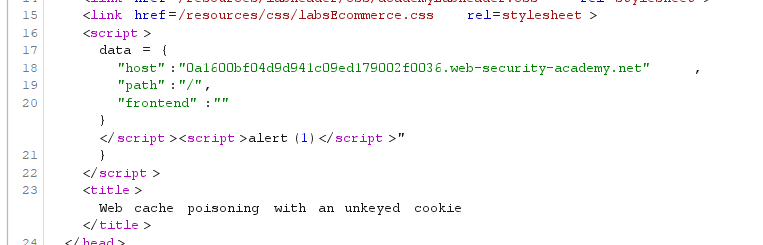

## Web cache poisoning with an unkeyed cookie

1. Nhận thấy giá trị của cookie được reflect lại trong response 

2. Có thể dễ dàng inject js thực hiện mục đích. Bật intercept để check 

3. Vì cache key không bao gồm cookie header nên sau khi gửi payload lên thành công, các user nào truy cập vào trang home của lab đều bị trả lại response có chứa payload.